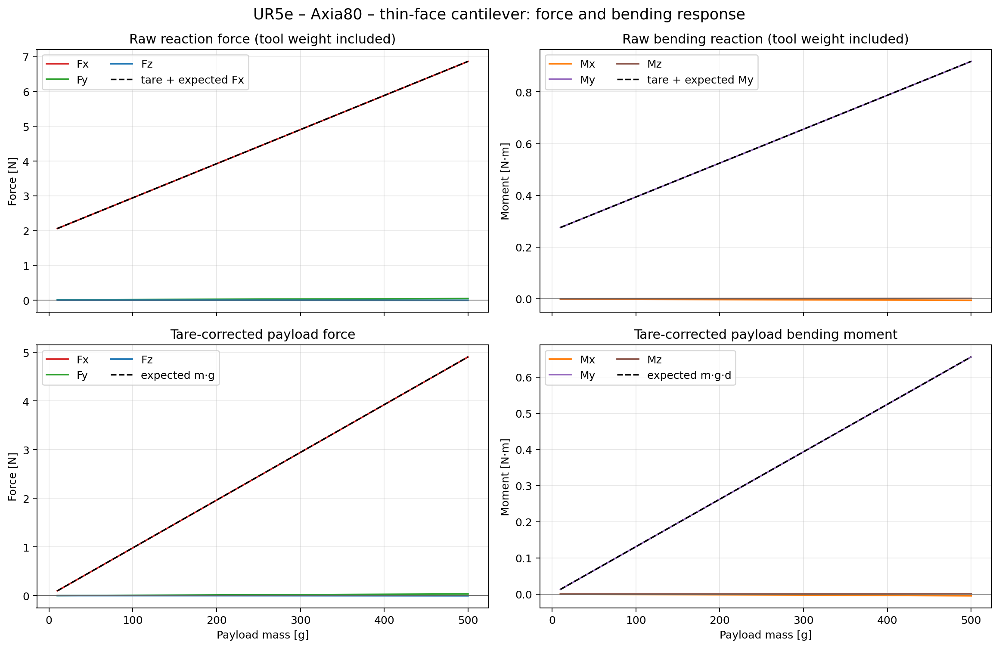
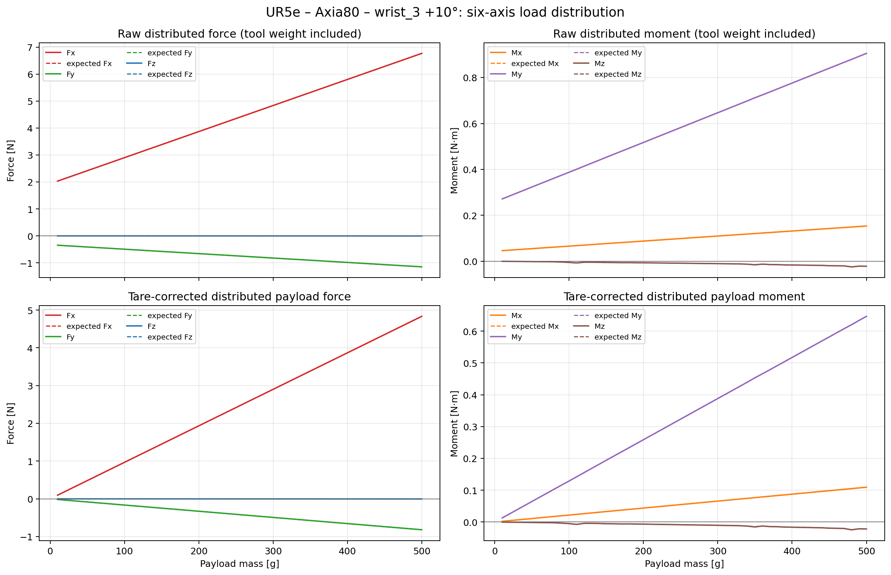
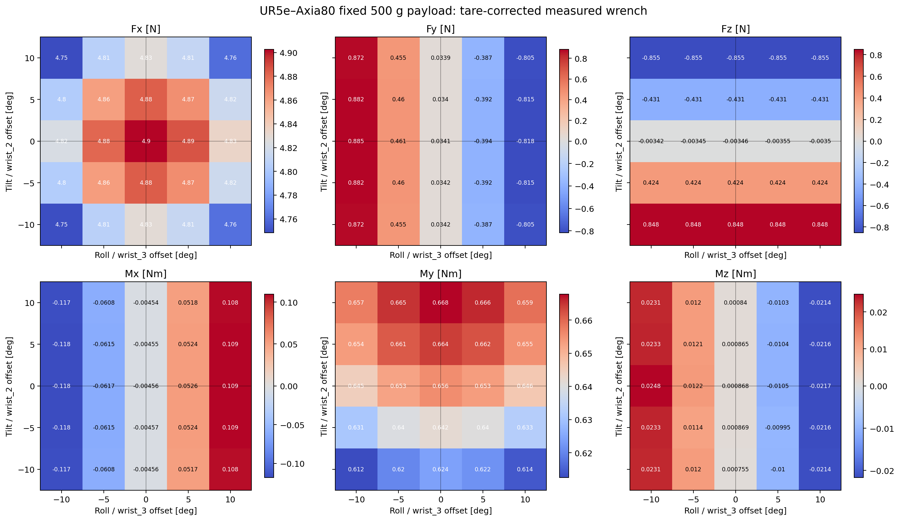
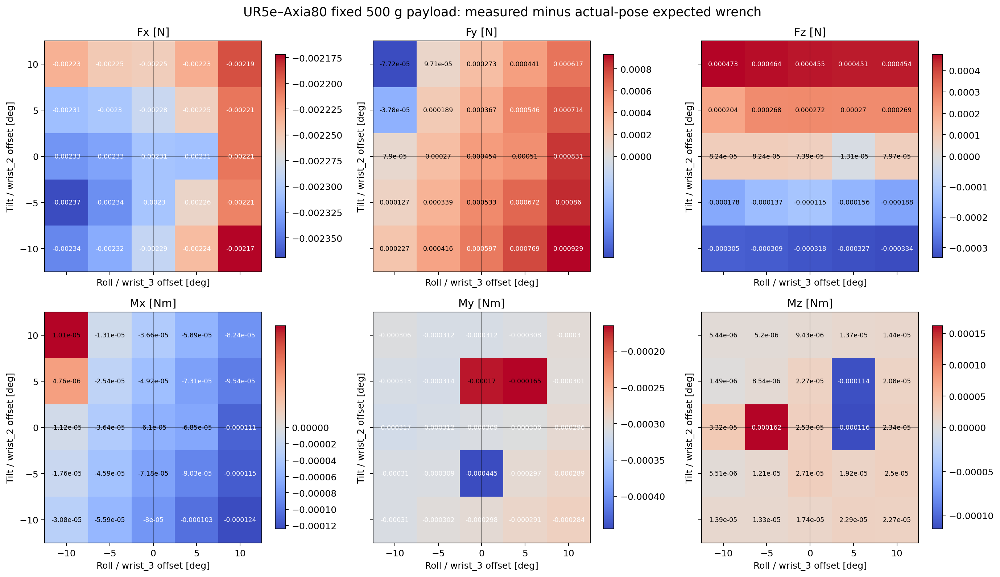
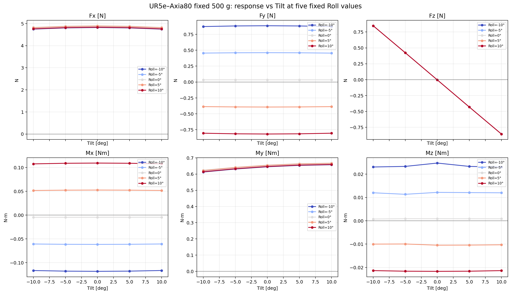
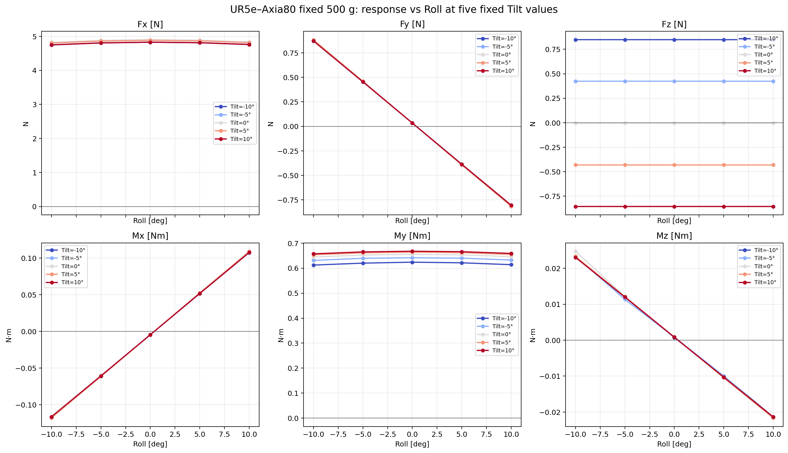
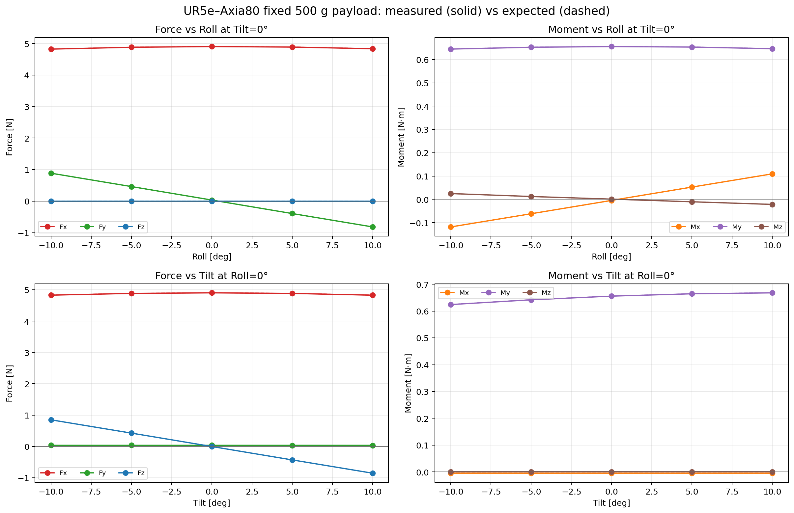

# 질량·손목 자세 변화에 대한 Axia80 F/T 출력은 예측 반력을 추종했다

Experiment ID: `AXIA80-FEASIBILITY-2026-09-22`

- 날짜: 2026-09-22
- 상태: completed / PASS
- 환경: Isaac Lab, GPU simulation, physics 240 Hz
- 목적: UR5e–Axia80–tool 구조에서 질량과 wrist 자세 변화가 6축 F/T 출력에
  의도한 방향과 크기로 반영되는지 확인
- 구현·재현 절차:
  [Isaac Lab UR5e–Axia80 F/T 구현 가이드](2026-09-22_axia80_ft_sensor_implementation.md)

## 요약

- 얇은 면으로 센서에 장착한 cantilever tool의 수평 질량 스윕에서 `Fx`와 `My`가
  10–500 g 구간에 대해 사실상 선형으로 증가했다. 기울기는 각각
  `9.8052 N/kg`, `1.31109 Nm/kg`였고 두 채널 모두 결정계수 `R² > 0.999999999`였다.
- Wrist3를 약 10° 회전한 질량 스윕에서는 반력이 `Fx`, `Fy`, `Mx`, `My`, `Mz`로
  분산됐다. 측정된 힘 분산각은 `9.603°`, 실제 pose로 계산한 기대값은
  `9.625°`로 오차는 `-0.022°`였다.
- 500 g 물체를 고정하고 Roll×Tilt를 `{-10, -5, 0, 5, 10}°`로 바꾼 25개
  vectorized 환경에서 모든 환경이 안정화됐다. 최대 force component 오차는
  `0.00237 N`, 최대 moment component 오차는 `0.000445 Nm`였다.
- 따라서 현재의 rigid-body 모델은 질량 및 자세에 따른 정적 wrench 분배를 검증하는
  feasibility 모델로는 합리적이다. 다만 실제 Axia80의 노이즈, 대역폭, drift,
  saturation, calibration 오차나 tool의 실제 탄성 변형까지 검증한 결과는 아니다.

> 범위 제외: Wrist3의 넓은 면에 tool을 직접 붙였던 최초 배치 결과는 잘못된
> 장착 조건이므로 본 문서와 복사 이미지에서 제외했다. 이후 thin-face 장착으로
> 수정한 결과만 다룬다.

## 시스템과 측정 정의

| 항목 | 설정 |
| --- | --- |
| Robot | UR5e |
| F/T sensor 형상 | 반지름 `0.041 m`, 높이 `0.0254 m`인 실린더 |
| Tool 형상 | `0.012 × 0.120 × 0.240 m` 직육면체 |
| Tool 장착 | 센서에 `0.012 × 0.120 m` 얇은 끝면을 부착하고 `+Z`로 연장 |
| Tool broad face | `0.120 × 0.240 m`, normal은 sensor frame의 `+X` |
| 시험 물체 | 한 변 `0.040 m`인 cube |
| Sensor frame | Axia80 중심, `+X`: broad-face normal, `+Z`: cantilever 축 |
| Wrench 순서 | `Fx, Fy, Fz, Mx, My, Mz` |
| 대표 lever arm | sensor 중심에서 payload 중심까지 `0.1337 m` |

### 센서 좌표계의 실제 방향

기준 수평 자세에서 이 문서와 CSV가 사용하는 Axia80 sensor-local frame의 방향은
다음과 같다.

- `+X`: 하늘 방향. Tool broad face에서 바깥쪽으로 향하는 normal이다.
- `+Z`: 정면 방향. Sensor에서 tool 끝으로 뻗어 나가는 cantilever 축이다.
- `±Y`: 옆 방향. `+Y`의 좌우는 오른손 좌표계로 결정된다.

옆에서 보면 `+X`와 `+Z`의 관계는 다음과 같다.

```text
          +X: 하늘
           ↑
Wrist ─ Sensor ─────────→ Tool 끝
                         +Z: 정면
```

Wrist 쪽에서 tool 끝을 바라보면 `+Z`는 화면 안쪽으로 향한다. 이 시점에서는
`+Y`가 화면의 왼쪽이고 `-Y`가 오른쪽이다. 반대쪽인 tool 끝에서 sensor 방향으로
바라보면 좌우는 반대로 보인다.

```text
             +X: 하늘
              ↑
     +Y  ←  Sensor
              ⊗ +Z: 화면 안쪽, tool 끝 방향
```

현재 실험의 joint 변화와 센서 축의 관계는 다음과 같다.

| 동작 | Joint | 회전축 | 주로 분산되는 힘 |
| --- | --- | --- | --- |
| Roll | `wrist_3_joint` | 정면축 `Z` 주위 | `Fx ↔ Fy` |
| Tilt | `wrist_2_joint` | 옆축 `Y` 주위 | `Fx ↔ Fz` |

따라서 기본 수평 자세에서 중력 반력은 주로 `+Fx`에 나타난다. Wrist3 Roll을 주면
`Fy`가 생기고, Wrist2 Tilt를 주면 `Fz`가 생긴다. Tool이 정면 `+Z` 방향으로
길기 때문에 기본 bending moment는 주로 `+My`에 나타난다. 모든
`Fx, Fy, Fz, Mx, My, Mz`는 world frame이 아니라 이 sensor-local frame 기준이다.

Tool 폭은 로봇과의 self-collision 여유를 확보하기 위해 초기 thin-face 구현의
`0.160 m`에서 `0.120 m`로 줄였다. Tool과 sensor는 fixed joint로 연결된다. 따라서
이 시험에서 “휘어짐”은 눈에 보이는 탄성 변형이 아니라, offset payload가 만드는
bending moment가 sensor joint로 전달되는 현상을 의미한다.

그래프의 주 응답은 tool-only tare를 뺀 값이다.

```text
tare-corrected wrench = raw wrench - tool-only tare wrench
```

`Raw`에는 sensor 아래 tool의 자중 반력이 포함되고, `Tare-corrected`에는 물체를
올려서 추가된 반력만 남는다.

## 1. 수평 cantilever에서 10–500 g 질량 스윕

50개 환경에 10 g부터 500 g까지 10 g 간격의 서로 다른 질량을 동시에 배치했다.
모든 환경은 `1.495833 s`에 안정화 판정을 받았고, 이후 환경별 240개 sample을
1초 동안 수집했다.

수평 자세의 기대 주 채널은 다음과 같다.

```text
Fx = mass × gravity
My = mass × gravity × 0.1337 m
```

| 지표 | 결과 |
| --- | ---: |
| `Fx` 기울기 | `9.805159 N/kg` |
| `Fx` 결정계수 | `0.999999999991` |
| `Fx` 최대 절대 오차 | `0.002419 N` |
| `My` 기울기 | `1.311092 Nm/kg` |
| `My` 결정계수 | `0.999999999386` |
| `My` 최대 절대 오차 | `0.000254 Nm` |
| 추정 lever arm 최대 오차 | `0.0000141 m` |



`Fx`와 `My` 모두 질량에 따라 단조 증가했고, 기대식과 거의 겹쳤다. 이는 수직
하중과 cantilever bending moment가 의도한 sensor frame 채널로 전달됨을 보여준다.

## 2. Wrist3 약 10° 회전 후 10–500 g 질량 스윕

동일한 질량 범위와 vectorization을 유지한 채 Wrist3를 약 10° 회전했다. 경사면에서
물체가 미끄러지는 효과와 wrench 분배 자체를 분리하기 위해 tool/payload 마찰계수는
static `2.0`, dynamic `1.5`로 설정했다. 기대값은 명령각 10°가 아니라 simulator에서
측정한 실제 tool pose로 계산했다.

| 지표 | 결과 |
| --- | ---: |
| 측정 force 분산각 | `9.603070°` |
| 실제 pose 기반 기대 force 분산각 | `9.625373°` |
| force 분산각 오차 | `-0.022303°` |
| 측정 bending 분산각 | `9.601349°` |
| 실제 pose 기반 기대 bending 분산각 | `9.624319°` |
| bending 분산각 오차 | `-0.022970°` |
| 최대 downhill displacement | `0.002539 m` |
| 최대 payload–tool 상대각 | `0.176939°` |
| 최소 edge margin | `0.037461 m` |



회전 후 질량에 대한 선형 기울기는 `Fx = 9.66798 N/kg`,
`Fy = -1.63575 N/kg`, `Mx = 0.218706 Nm/kg`, `My = 1.292884 Nm/kg`,
`Mz = -0.043528 Nm/kg`였다. 500 g에서 측정한 tare-corrected wrench는 다음과 같다.

| 채널 | 측정값 |
| --- | ---: |
| `Fx` | `4.83398 N` |
| `Fy` | `-0.81790 N` |
| `Fz` | `-0.00350 N` |
| `Mx` | `0.10935 Nm` |
| `My` | `0.64637 Nm` |
| `Mz` | `-0.02168 Nm` |

수평 시험에서 주로 `Fx`, `My`에 모이던 반력이 회전 후 `Fy`, `Mx`, `Mz`에도
나뉘었다. 각 component의 최대 기대값 오차는 force `0.002303 N`, moment
`0.001091 Nm` 이하였다.

## 3. 500 g 고정 질량의 Roll×Tilt 스윕

물체 질량을 500 g으로 고정하고 다음 5×5 조합을 25개 환경에서 동시에 실행했다.

- Roll: `wrist_3_joint`의 기준 자세 대비 변화량
- Tilt: `wrist_2_joint`의 기준 자세 대비 변화량
- 각도 집합: `-10°, -5°, 0°, 5°, 10°`
- 마찰계수: static `2.0`, dynamic `1.5`

실제 pose의 Roll을 `rho`, Tilt를 `tau`, payload 중심 offset을
`r = [h, 0, d]`, `h = 0.026 m`, `d = 0.1337 m`로 두면 비교에 사용한 정적
기대식은 다음과 같다.

```text
Fx = m g cos(tau) cos(rho)
Fy = -m g cos(tau) sin(rho)
Fz = -m g sin(tau)

Mx = -d Fy
My = d Fx - h Fz
Mz = h Fy
```



응답 heatmap에서 Roll 변화는 주로 `Fy`, `Mx`, `Mz`에, Tilt 변화는 주로 `Fz`와
`My`에 나타났다. `Fx`는 두 각도가 커질수록 cosine 성분에 따라 완만하게 감소했다.



| 검증 지표 | 결과 |
| --- | ---: |
| 전체 환경 안정화 | `25 / 25` |
| 안정화 시간 | `1.495833 s` |
| Force component RMSE | `0.001356 N` |
| Moment component RMSE | `0.0001816 Nm` |
| 최대 force component 오차 | `0.002369 N` |
| 최대 moment component 오차 | `0.000445 Nm` |
| 최대 force 방향 오차 | `0.007621°` |
| 최대 moment 방향 오차 | `0.015711°` |
| 최대 tangent displacement | `0.000364 m` |
| 최대 payload–tool 상대각 | `0.079129°` |
| 최소 폭/길이 edge margin | `0.039636 / 0.099880 m` |
| 최대 실제 합성 경사각 | `14.398736°` |
| 최대 필요 정지마찰계수 | `0.256732` |

필요 정지마찰계수의 최댓값 `0.2567`은 설정값 `2.0`보다 충분히 작았고, 물체의
미끄러짐과 회전도 허용 범위 안에 유지됐다. 따라서 이 sweep에서 관측한 채널 변화는
payload 이탈보다 sensor frame에 대한 중력 방향 변화로 설명된다.

## 4. 한 축을 고정한 각도 응답

동일한 25개 환경의 기존 summary CSV만 사용해 한 축을 고정한 두 그래프를 추가로
만들었다. 별도의 simulation은 실행하지 않았다.



Roll을 각각 `-10°, -5°, 0°, 5°, 10°`로 고정하면 Tilt 증가에 따라 `Fz`가
양수에서 음수로 바뀌고 `My`가 함께 변한다. 반면 같은 Roll 곡선 안에서 `Fy`,
`Mx`, `Mz`의 변화는 상대적으로 작다.



Tilt를 각각 `-10°, -5°, 0°, 5°, 10°`로 고정하면 Roll 증가에 따라 `Fy`,
`Mx`, `Mz`의 부호와 크기가 연속적으로 변한다. 예를 들어 Tilt 0°에서 Roll을
`-10° → +10°`로 바꾸면 `Fy`는 약 `+0.885 → -0.818 N`, `Mx`는
`-0.118 → +0.109 Nm`, `Mz`는 `+0.0248 → -0.0217 Nm`로 변했다.

두 중심 단면을 한 그림에서 비교하면 축별 결합 관계를 더 직접적으로 볼 수 있다.



## 결론

| 검증 질문 | 관측 결과 | 판정 |
| --- | --- | --- |
| 질량 증가가 힘에 선형 반영되는가? | `Fx` 기울기 `9.8052 N/kg`, `R² > 0.999999999` | PASS |
| offset 하중이 bending moment로 전달되는가? | `My` 기울기 `1.31109 Nm/kg`, lever arm 오차 `0.014 mm` 이하 | PASS |
| Wrist3 회전 시 반력이 여러 축으로 분산되는가? | 실제 pose 기대 분산각 대비 오차 약 `0.022°` | PASS |
| Roll/Tilt 변화가 기대 축에 나타나는가? | 실제 pose 기반 최대 component 오차 `0.00237 N`, `0.000445 Nm` | PASS |
| sweep 동안 물체가 tool 위에 유지되는가? | 모든 환경 안정화, 최소 edge margin `39.6 mm` | PASS |

현재 구현은 rigid-body 정적 F/T feasibility 검증 목적에 부합한다. 특히
tare-corrected wrench가 질량, lever arm, 실제 wrist pose로 계산한 기대값을 작은
오차로 추종한다. 다음 단계에서 실제 Inspire Robot tool 형상이나 실제 Axia80 특성을
대입할 때에는 sensor noise, sampling/latency, overload, temperature drift, calibration,
tool compliance를 별도 모델 또는 실측으로 검증해야 한다.

## 원시 산출물과 재현 코드

### 수평 질량 스윕

- [Summary CSV](../../artifacts/axia80_feasibility/results/cantilever_narrow_10g_to_500g/axia80_cantilever_summary.csv)
- [Sample CSV](../../artifacts/axia80_feasibility/results/cantilever_narrow_10g_to_500g/axia80_cantilever_samples.csv)
- [Metadata](../../artifacts/axia80_feasibility/results/cantilever_narrow_10g_to_500g/axia80_cantilever_metadata.json)
- [Run log](../../artifacts/axia80_feasibility/results/cantilever_narrow_10g_to_500g/axia80_cantilever_run.log)

### Wrist3 약 10° 질량 스윕

- [Summary CSV](../../artifacts/axia80_feasibility/results/tilted_cantilever_10deg_10g_to_500g_pose_checked/axia80_tilted_cantilever_summary.csv)
- [Sample CSV](../../artifacts/axia80_feasibility/results/tilted_cantilever_10deg_10g_to_500g_pose_checked/axia80_tilted_cantilever_samples.csv)
- [Metadata](../../artifacts/axia80_feasibility/results/tilted_cantilever_10deg_10g_to_500g_pose_checked/axia80_tilted_cantilever_metadata.json)
- [Run log](../../artifacts/axia80_feasibility/results/tilted_cantilever_10deg_10g_to_500g_pose_checked/axia80_tilted_cantilever_run.log)

### 500 g Roll×Tilt 스윕

- [Summary CSV](../../artifacts/axia80_feasibility/results/wrist_angle_sweep_500g_roll_tilt_10deg/axia80_wrist_angle_summary.csv)
- [Sample CSV](../../artifacts/axia80_feasibility/results/wrist_angle_sweep_500g_roll_tilt_10deg/axia80_wrist_angle_samples.csv)
- [Metadata](../../artifacts/axia80_feasibility/results/wrist_angle_sweep_500g_roll_tilt_10deg/axia80_wrist_angle_metadata.json)
- [Run log](../../artifacts/axia80_feasibility/results/wrist_angle_sweep_500g_roll_tilt_10deg/axia80_wrist_angle_run.log)

### 구현

- [Cantilever 실행 스크립트](../../artifacts/axia80_feasibility/scripts/run_cantilever_payload_test.py)
- [Wrist3 10° 실행 스크립트](../../artifacts/axia80_feasibility/scripts/run_tilted_cantilever_payload_test.py)
- [Roll×Tilt 실행 스크립트](../../artifacts/axia80_feasibility/scripts/run_wrist_angle_sweep.py)
- [기존 CSV 단면 plot 스크립트](../../artifacts/axia80_feasibility/scripts/plot_wrist_angle_fixed_sweeps.py)

## 해석 범위와 한계

- 모든 결과는 Isaac Lab simulation 값이다. 실제 센서 calibration 결과가 아니다.
- 각 환경의 240개 sample은 안정화 후 시간 평균을 위한 값이며, 독립 반복 실험
  240회를 의미하지 않는다.
- 기대 wrench는 simulator에서 측정한 실제 tool pose와 알려진 질량·offset으로
  계산했다. 따라서 joint tracking 오차를 sensor 오차로 잘못 세지 않는다.
- fixed joint와 rigid body를 사용하므로 실제 tool의 처짐, 진동 mode, 재료 비선형성은
  포함하지 않는다.
- high-friction 조건은 경사면에서 payload를 유지해 wrench 분배를 분리해 보기 위한
  시험 조건이다. 실제 gripper 소재의 마찰계수로 해석하면 안 된다.
