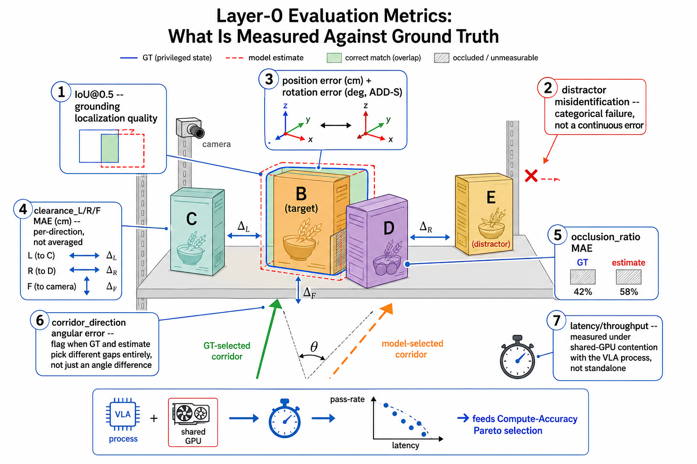

# (초안) Layer-0 평가 지표 상세 설명

> 작업용 임시 문서. `vlm_perception_model_evaluation.md` §4.4(지표)를 더 자세히 풀어썼다. 확정되면 본문에 병합하고 이 파일은 삭제한다.



위 그림은 부록의 프롬프트로 생성한 결과다. 번호는 아래 §1~2의 각 지표와 1:1 대응한다 — ①IoU@0.5, ②distractor 오탐(범주적 실패), ③위치/회전오차, ④clearance MAE(방향별), ⑤occlusion_ratio MAE, ⑥corridor_direction 각오차(이산 선택 문제), ⑦co-located latency. 하단 배너는 §3 Compute-Accuracy Pareto로 이어지는 흐름을 보여준다.

---

## 1. Grounding VLM 지표

### 1.1 top-1 grounding 정확도
언어 지시(referring expression)에 대해 모델이 1순위로 지목한 bbox/mask가 GT 목표 물체와 일치(IoU≥0.5)하는 비율. **1.2의 IoU@0.5와 겹치는 것처럼 보이지만 다른 것을 잰다** — top-1은 "여러 후보 중 맞는 걸 골랐는가"(선택), IoU@0.5는 "고른 박스가 얼마나 정확한가"(localization). 완전히 다른 물체를 지목하면 top-1이 실패하고, 이후 pose 오차가 아무리 작아도 무의미하다 — 범주적 실패(§5 참고).

### 1.2 IoU@0.5
bbox/mask overlap ratio. 임계값 하나(0.5)만 쓰는지, 0.5/0.75 등 여러 지점의 curve(AP-style)를 볼지는 아직 안 정했다.

### 1.3 distractor 오탐율
장면에 목표와 시각적으로 유사한 distractor가 있을 때 그것을 목표로 잘못 지목하는 비율. top-1 평균만 보면 "쉬운 장면 다수 + distractor 장면 소수"가 섞여 약점이 묻힌다 — distractor 밀도별 층화가 필요. 참조 표현 자체가 모호("왼쪽 컵"이 두 개를 가리킬 수 있음)한 경우는 GT 생성 단계에서 표현의 유일성을 보장해야 이 지표가 깨끗해진다.

### 1.4 abstention / calibration
목표가 장면에 없거나 지시가 모호할 때 "모른다"고 답할 수 있는가. **측정 방법이 아직 미정** — (모른다고 답해야 할 때 실제로 그런 비율) 방식의 precision/recall로 잴지, confidence score의 ECE(calibration error)로 잴지 §4.4 원문엔 이름만 있고 계산법이 없다. 중요한 이유: grounding이 틀린 목표에 확신을 가지면 그 페이로드가 그대로 Gate 1을 거쳐 DRL 접촉 정책까지 흘러간다 — abstention은 이 흐름을 막는 안전장치.

### 1.5 latency/throughput
단일 forward pass 지연시간(ms), 배치 처리량(images/sec). **주의**: §4.4는 grounding·perception 각각의 latency를 따로 나열하지만, grounding→segmentation→pose→기하후처리로 이어지는 **스택 전체의 end-to-end latency**는 별도로 명시돼 있지 않다. Pareto(§3)에 들어갈 값은 스택 총합이어야 한다.

---

## 2. RGB-D Perception 지표

### 2.1 `p_target` 위치오차(cm) / 회전오차(deg, ADD-S)
위치오차는 추정 translation과 GT translation의 유클리드 거리. 회전오차는 ADD-S(대칭 인식 평균 거리)로, 원통·병처럼 회전 대칭인 물체의 모호성을 흡수한다. 비대칭 물체엔 일반 ADD를 쓸지 ADD-S로 통일할지는 미기재. pass 기준은 위치(≤2cm)만 §1에 있고, 회전오차 자체엔 없다 — corridor_direction 계산이 회전 오차에 얼마나 민감한지에 따라 별도 임계값이 필요할 수 있다.

### 2.2 `clearance_L/R/F` MAE(cm)
3방향 각각의 clearance 추정치-GT 절대오차 평균. pass 기준 ≤1cm(§1). **함정**: 세 방향을 평균 내면 "한 방향만 크게 틀리고 나머지는 맞는" 케이스가 숨는다. corridor_direction 선택은 방향 간 최대/최소 비교이므로, 평균 오차가 작아도 방향 간 순위가 뒤집히면 downstream이 엉뚱한 방향을 고를 수 있다 — per-direction MAE 외에 "순위 역전 비율" 같은 지표가 필요.

### 2.3 `occlusion_ratio` MAE
추정 가시율-GT 가시율 절대오차. **pass 기준 없음.** payload 표(연구 로드맵 §2.3 ④)에서 이 값은 `p_target` 신뢰도를 판단하는 쌍으로 쓰이는데, 자체 오차 허용범위가 없으면 "신뢰도 지표"라는 존재 이유를 검증할 방법이 없다.

### 2.4 `corridor_direction` 각오차(deg)
선택된 통로 방향과 GT 방향 사이 각도. **pass 기준 없음** — 그보다 더 근본적인 문제: corridor 선택은 연속값이 아니라 사실상 **이산 선택**(여러 틈 후보 중 하나를 고르는 것)이다. "5도 틀렸다"와 "완전히 다른 틈을 골랐다"는 각오차 평균으로는 구분이 안 되는데, downstream 입장에선 후자가 훨씬 치명적이다. 각오차와 별도로 "top-1 corridor 선택 정확도"(이산 지표)를 둬야 한다.

### 2.5 latency/throughput
세그멘테이션+pose 스택 전체의 배치 처리량. VLA와 GPU를 공유할 때의 contention을 포함한 실효값이어야 한다는 점은 §4.4 본문이 이미 명시.

---

## 3. Compute-Accuracy Pareto — 아직 정의되지 않은 것

앞선 논의에서 지적했듯, 6개 정확도 지표(top-1, IoU, distractor 오탐율, 위치오차, clearance MAE, occlusion MAE, corridor 각오차)를 하나의 Pareto y축으로 합치는 방법이 §4.4에 없다. 두 후보:

| 방식 | 설명 | 장점 | 단점 |
|---|---|---|---|
| **(A) Pass-rate** | §1 임계값(위치≤2cm, clearance≤1cm)을 만족한 trial 비율을 단일 스칼라로 사용 | downstream 영향과 직결, 해석 쉬움 | occlusion/corridor처럼 임계값 없는 지표는 포함 불가 |
| **(B) 정규화 가중합** | 지표별 정규화 후 가중합 | 모든 지표 포함 가능 | 가중치가 자의적 — §6.1의 "그냥 리더보드" 비판과 같은 종류의 취약점 |

**권장**: (A)를 1차 Pareto 축으로 쓰고, occlusion_ratio·corridor_direction은 §2.3/2.4에서 제안한 pass 기준을 먼저 확정한 뒤 편입한다. (B)는 보조 분석으로만 부록에 남긴다.

---

## 4. Downstream 예측 타당도

Spearman correlation의 대상이 "어떤 오프라인 지표"인지 먼저 정해야 한다 — 6개 지표 각각과 grasp 성공률의 개별 상관을 볼지, §3에서 정의할 단일 Pareto 스칼라와의 상관만 볼지에 따라 결론이 달라진다. **권장 순서**: 개별 지표별 상관을 먼저 보고(어떤 지표가 실제로 예측력이 있는지 확인) → 그 결과로 §3의 가중치/포함 여부를 역으로 보정.

---

## 5. 지표 체계의 구조적 공백 (요약)

| 공백 | 위치 |
|---|---|
| Pareto 단일 축 미정 | §3 |
| `occlusion_ratio`/`corridor_direction` pass 기준 없음 | §2.3, §2.4 |
| 범주적 실패(그라운딩 오류) vs 연속 오차 미분리 | §1.1, §2.4 |
| corridor 선택은 이산 문제인데 각오차(연속)로만 측정 | §2.4 |
| tail latency(p95/p99) 없음, 평균만 | §1.5, §2.5 |
| 스택 전체 end-to-end latency 미정의 | §1.5 |

---

## 6. VLM 고차 추론 확장 논의 — PI-1/PI-2 접촉 순서, 팔 부위 접촉 피드백

> 현재 Layer-0의 VLM은 목표 물체 식별(grounding) 외의 추론을 하지 않는다. 여기서는 "목표 B를 grasp하기 위해 앞의 C를 1st physical interaction(PI-1), 옆의 D를 2nd physical interaction(PI-2)으로 식별하고, PI-1은 좌측, PI-2는 우측으로 밀며 접촉을 유지한 채 B까지 접근한다"는 아이디어와, "팔의 어느 부위가 무엇과 접촉 중인지"를 텍스트로 변환해 VLM의 multi-task prompt에 넣어 되먹임하자는 아이디어를 `research_roadmap.md` 기존 설계와 대조한다.

### 6.1 진짜 필요한 건 물성이 아니라 "복수 corridor 후보 + 연쇄 결과" 표현이다

> (수정 이력) 이 절은 원래 "PI-1/PI-2 순서를 정하려면 물체 질량·전도 취약성(§2.3 payload 표 ⑦, 의도적으로 제외된 값)이 필요하다"고 썼으나, 이는 과녁이 빗나간 지적이었다 — 어느 물체를 먼저 밀지는 "그 물체가 무겁냐 가벼우냐"의 문제가 아니라, **어느 틈을 통로로 쓸 것인가라는 경로/위상(topology) 문제**다.

지금 `corridor_direction`(§2.3 ⑥)의 정의 자체가 이 문제를 다루지 못하게 돼 있다 — "후보 틈 중 최대 폭을 고르는 결정론적 규칙"이라, **그 순간 가장 넓은 틈 하나만 고를 뿐, 그 틈을 여는 push가 다른 이웃과 또 접촉을 만드는지는 전혀 모델링하지 않는다.** 예: 목표 B 옆에 D, 그 너머에 E가 있는 배치에서 B-D 틈이 지금 제일 넓어 보여도, D를 그만큼 밀면 D가 E 쪽으로 밀려가며 두 번째 접촉이 생길 수 있다 — 반대로 D를 조금만 좌측으로 밀고 B-E 쪽 틈으로 접근하는 경로가 더 안전할 수도 있다. "폭 최대값 고르기"라는 단일 스칼라 규칙은 이 두 경로의 차이를 애초에 볼 수 없다.

즉 필요한 건 물성 지식이 아니라 **여러 틈 후보 + 각 후보를 열었을 때의 결과(연쇄 접촉 발생 여부, 몇 단계 push가 필요한지)를 함께 보는 짧은 lookahead/그래프 표현**이다. 이는 순수 기하 정보(현재 payload가 이미 갖고 있는 pose·clearance)만으로 원칙적으로 계산 가능한 확장이라, ⑦(질량·전도 취약성 제외)과는 무관한 **별개의 공백**이다.

> (수정 이력 2) 이 문단은 원래 "Gate 1′(§2.4)의 복귀-재시도가 명시적 계획 없이도 fallback으로 충분할 수 있다"고 썼으나, 이 역시 재고했다.

Gate 1′이 "진전 없으면 VLA로 복귀"를 갖고 있고 Layer 0이 연속 갱신되므로(§1.3), "한 틈을 시도하다 막히면 복귀 → 상태 재계산 → 다른 틈으로 재시도"라는 경로 자체는 실제로 존재한다. 하지만 이걸 "계획이 필요 없다는 근거"로 쓰기엔 두 가지가 안 맞는다:

1. **물리적 시도는 소프트웨어 재시도처럼 가역적이지 않다.** D를 밀었다가 E와 부딪히는 걸 확인하고 물러나는 과정에서 D·E가 넘어지거나 예측 못한 방향으로 밀릴 수 있다 — §1.2가 요구하는 "이웃 물체 전도 방지" 자체를 이 시행착오 중에 위반할 위험이 있다.
2. **이 실패 모드는 희귀 케이스가 아니라 이 프로젝트의 정의역이다.** §1.2의 표적 시나리오가 원래 "여러 이웃 물체 + 부분 가림"이므로, "폭 최대값만 보는 규칙이 연쇄 접촉을 놓치는" 상황은 이웃이 2개 이상이면 상시 발생할 수 있다. 즉 안전망으로 감당할 빈도가 아니라 거의 매 에피소드 걸릴 수 있는 비용이다.

따라서 결론을 바꾼다: 복귀-재시도 루프는 "정말 예측 못한 예외"에 대한 안전망으로만 남겨두고, **corridor_direction 계산에 최소 1단계 lookahead("이 틈을 밀면 다른 이웃과 부딪히는가")를 최초 추론 시점에 넣는 쪽이 맞다.** 진짜 남는 질문은 "계획이 필요한가"가 아니라 **"몇 단계 lookahead까지 필요한가"** — 1-hop(직접 인접 이웃까지만 확인)로 충분한지, 아니면 §1.2의 클러터 밀도(K=1~5)가 커질수록 다단계 탐색이 필요한지는 §5 실험 프로토콜(occlusion bin × 클러터 밀도별 stratify)에서 클러터 밀도별로 성공률이 어떻게 변하는지를 봐야 확인 가능한 **실험 질문**이다.

### 6.2 팔 부위별 접촉 피드백은 vision-free 원칙과 충돌하지 않는다 — 다만 비동기·저빈도로만 유효하다

> (수정 이력) 이 절은 원래 "팔 부위별 접촉 피드백을 VLM 루프에 태우는 것은 vision-free 반응 루프 원칙과 어긋난다"고 썼으나, 이는 두 가지를 혼동한 주장이었다. 첫째, arm-segment 접촉 신호는 **vision 기반 perception이 아니라 센서(F/T·tactile) 직접 신호**다 — "vision-free" 원칙은 "DRL 행동 결정이 vision에 의존하지 않는다"는 것이지 "VLM에 어떤 신호도 넣지 말라"는 것이 아니므로, 애초에 이 원칙이 적용될 대상이 아니다. 둘째, Layer-0은 1회성 호출이 아니라 §1.3에 따라 **연속 갱신되는 상위 supervisor**이고, DRL 루프는 이미 payload의 최신 스냅샷을 non-blocking으로 소비하는 구조다 — VLM이 이 신호를 처리하는 데 시간이 걸려도, 그 latency가 50~100Hz 제어 루프를 blocking하지 않는다면 "fast loop에 끼어든다"는 원래 주장은 성립하지 않는다.

즉 팔 부위 접촉 상태를 텍스트화해 VLM에 되먹이는 것 자체는 원칙 위반이 아니다. 다만 유효하려면 두 조건이 붙는다:

1. **반드시 비동기·저빈도 요약**이어야 한다 — payload와 같은 entry-snapshot/주기적 갱신 패턴을 따라야지, DRL의 매 스텝에 맞춰 VLM 응답을 기다리는 구조가 되면 그때는 실제로 latency가 재도입된다.
2. **Step-3 접촉 귀속(attribution) 문제를 이걸로 "해결"하는 것은 아니다.** 손목 F/T가 net force만 주는 문제(부록 C, "△ 합력 한계, Step-3 난제")는 여전히 F/T 시계열 + proprioception history + payload clearance로 DRL 정책 내부에서 암묵 추론해야 하는 미해결 항목으로 남는다. 이 텍스트 피드백의 실질적 쓸모는 attribution 자체가 아니라, §6.1의 lookahead가 **예측하지 못한 실제 다중접촉**이 발생했을 때 VLM이 corridor/PI-1·PI-2 계획을 선제적으로 재조정하는 신호로 쓰는 것이다 — 말하자면 §6.1(사전 lookahead)과 Gate 1′(사후 재시도)의 중간 지점에 있는, "실행 중 계획 수정" 채널이다.

### 6.3 perception → VLM: 저수준 지표는 관계 추론의 입력이어야 한다

현재 §1(Grounding VLM 지표)과 §2(RGB-D Perception 지표)는 두 파이프라인의 산출물을 병렬 항목으로 나열하고 있어, 마치 VLM은 grounding만 하고 perception은 독립적으로 pose·clearance·occlusion·corridor를 계산해 각자 Gate 1 payload에 기여하는 것처럼 보인다.

하지만 VLM이 더 큰(더 일반화된) 모델이라는 점을 생각하면 구조가 반대여야 한다 — **perception이 저수준 기하(위치, clearance_L/R/F, occlusion, corridor 후보)를 먼저 계산하고, 그 결과를 VLM의 prompt 입력으로 넣어준 뒤, VLM이 grounding뿐 아니라 그 위에서 물체 간 관계 추론(PI-1/PI-2 선정, 어느 코너로 진입할지)을 수행하는 편이 맞다.** VLM의 차별점은 세부 기하 추정 정확도가 아니라 여러 물체 사이의 관계를 읽는 능력이기 때문이다.

저수준 지표의 역할은 여기서 한정된다 — clearance가 좁다고 시스템이 더 넓은 자리를 찾아 grasp 지점을 바꾸는 것이 아니다(목표물의 grasp 지점은 고정). 저수준 지표는 grasp 지점을 결정하는 데 쓰이는 게 아니라, 그 고정된 지점까지 **어떤 경로로 밀고 들어갈지**를 판단하는 관계 추론의 입력 재료일 뿐이다.

이는 §6.1의 corridor lookahead 논의와 바로 연결된다 — "여러 corridor 후보 + 각 후보를 열었을 때의 연쇄 결과 비교"는 본질적으로 관계 추론 문제이므로, perception이 후보 corridor 목록과 그 기하 사실(각 틈의 폭, 이웃까지 거리 등)을 구조화해 제공하고 VLM이 그 위에서 최종 선택(+PI-1/PI-2 라벨)을 내리는 구조가, §6.1에서 제안한 순수 결정론적 규칙 확장보다 관계 추론에 더 적합할 수 있다. 다만 규칙 기반 lookahead가 더 저렴하고 검증하기 쉬우므로, "VLM에 위임하는 편이 낫다"고 이 시점에 단정하지는 않는다 — §6.5의 실험 질문으로 남긴다.

### 6.4 절충안

| 안 | 내용 | 비고 |
|---|---|---|
| **채택 검토 가능** | PI-1/PI-2 같은 심볼릭 라벨을 실시간 루프가 아니라 **진입 시점 스냅샷**(payload가 이미 이렇게 소비됨, §1.3)에 한해 페이로드 추가 필드로 얹는다 | corridor_direction처럼 결정론적 기하 계산으로 산출할 수도, §6.3처럼 perception이 제공한 후보 위에서 VLM이 관계 추론으로 산출할 수도 있다 — 어느 쪽이든 실시간 루프 밖(진입 시점)이라 §2.7 "학습 필요한 것은 DRL 정책 하나뿐" 전제를 깨지 않음 |
| **제한적 채택 가능** | 팔 부위 접촉 상태를 텍스트화해 VLM에 되먹인다 | §6.2 정정 참고 — 비동기·저빈도 요약으로 한정하고 DRL 제어 루프 자체에는 개입하지 않아야 함. vision-free 원칙 위반은 아니나 blocking 구조가 되지 않도록 주의 |

### 6.5 남는 질문

- PI-1/PI-2 순서 라벨이나 corridor lookahead(§6.1)가 실제로 downstream 성공률을 얼마나 높이는지, 그리고 몇 단계 lookahead(1-hop vs 다단계)부터 이득이 포화되는지는 **§4 downstream 상관관계 검증**과 같은 방식으로 클러터 밀도별 ablation(lookahead 0/1/N단계)을 돌려봐야 확인 가능 — 별도 실험 항목으로 §7 준비사항 체크리스트에 추가할지 검토.
- "이산적 순서 판단"과 "연속 clearance 신호"의 관계는 §2.4(corridor_direction이 사실은 이산 선택이라는 지적)와 같은 종류의 문제다 — 두 논의를 하나의 "이산 vs 연속 표현" 축으로 묶어서 다시 볼 필요가 있다.
- perception→VLM 순차 구조(§6.3)가 현재의 병렬/결정론적 규칙 구조보다 실제로 더 나은 PI-1/PI-2·corridor 판단을 내는지, 규칙 기반 lookahead 대비 검증이 필요하다 — 실험 후보.
- 비동기·저빈도 arm-contact 텍스트 피드백(§6.2)이 실제로 corridor 재계획에 도움이 되는지, 그리고 얼마나 저빈도여야 latency 제약을 지키는지 — 실험 후보.

---

## 부록: 지표 설명 그림 생성 프롬프트

`research_roadmap.md`의 `images/multi_obstacle_payload.png`(축 2 페이로드 그림)와 같은 형식 — 장면 위에 번호 콜아웃을 얹어 각 지표가 무엇을 재는지 시각적으로 보여준다.

<details>
<summary>프롬프트 — 평가 지표 해부도 (GT vs 모델 추정치)</summary>

```
Create a clean technical evaluation diagram, flat vector illustration, white
background, engineering-blueprint style, titled "Layer-0 Evaluation Metrics:
What Is Measured Against Ground Truth".

Scene: a shelf with three objects -- target object B (highlighted orange,
labeled "B (target)") in the center, neighbor object C to the left, neighbor
object D to the right partially occluding B's front-bottom corner. A fourth
object E, visually similar to B, sits further to the side labeled "distractor".

Superimpose two faint outlines around B: a solid blue silhouette labeled
"GT (privileged state)" and a dashed red silhouette labeled "model estimate",
offset slightly to show an estimation gap.

Add seven circled numbered callouts with leader lines:

1. Around B: two overlapping rectangles (GT solid blue, estimate dashed red),
   overlap region shaded green -- "① IoU@0.5 -- grounding localization quality".

2. A red X near distractor object E with a short dashed arrow showing the
   model briefly pointing at E instead of B -- "② distractor misidentification
   -- categorical failure, not a continuous error".

3. A small 3-axis pose triad icon on B in blue (GT) next to a duplicate in red
   (estimate), connected by a double-headed arrow -- "③ position error (cm) +
   rotation error (deg, ADD-S)".

4. Three short double-headed arrows in the gaps: B-to-C (left), B-to-D
   (right), B-to-camera (front), each with a small delta symbol -- "④
   clearance_L/R/F MAE (cm) -- per-direction, not averaged".

5. A partial transparency overlay on the portion of B occluded by D: gray
   hatch for occluded area, solid orange for visible area, with two small
   percentage labels side by side (GT % vs estimate %) -- "⑤ occlusion_ratio
   MAE".

6. In the gap region between objects: a solid green arrow marking the
   GT-selected free-space corridor and a dashed orange arrow marking the
   model's selected corridor pointing toward a DIFFERENT gap, with a small
   angle arc between them where they overlap -- "⑥ corridor_direction angular
   error -- flag when GT and estimate pick different gaps entirely, not just
   an angle difference".

7. A small stopwatch icon at the bottom -- "⑦ latency/throughput -- measured
   under shared-GPU contention with the VLA process, not standalone".

Bottom banner: a small schematic scatter-plot icon (x-axis "latency", y-axis
"pass-rate") with an arrow leading into it labeled "-> feeds Compute-Accuracy
Pareto selection".

Color code: blue = ground truth, red/orange dashed = model estimate, green
shading = correct match, gray hatch = occluded/unmeasurable region. Rounded
numbered circle badges, clean sans-serif labels, minimal clutter,
teaching-figure style suitable for a methods-section figure.
```

</details>
