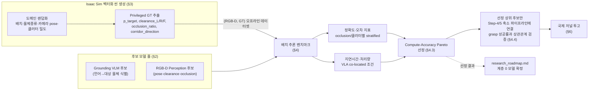

# Layer 0 후보 모델 평가: Grounding VLM · RGB-D Perception 벤치마크

> [research_roadmap.md](research_roadmap.md)의 **계층 0**(Grounding VLM + RGB-D Perception, §1.3/§2.3)을 구현하려면 특정 모델을 정해야 한다. 오픈소스 후보군을 Isaac Sim에서 대규모 도메인 랜덤화로 정량 평가하여, **주어진 컴퓨팅 예산(GPU 1장, VLA와 co-located) 안에서 목표 loop rate(1~5Hz)를 만족하면서 정확도가 가장 높은 조합**을 고른다. 이 문서는 그 평가 프로토콜과, 결과를 국제 저널 논문으로 만들기 위한 설계를 다룬다.

---

## 0. 전체 파이프라인



**이 그림이 이 문서의 골격이다.** 왼쪽 후보 모델 풀과 Isaac Sim 벡터화 씬 생성이 독립적으로 준비되고, 배치 추론 벤치마크에서 결합된다. 결과는 두 갈래로 쓰인다 — (a) 계층 0 모델을 실제로 확정해 로드맵에 반영, (b) 벤치마크 자체를 논문으로 산출.

---

## 1. 목적과 위치

`research_roadmap.md`는 계층 0을 "Grounding VLM(텍스트 능력 보존, §2.8) + RGB-D Perception(연속 payload 발행, §2.3)"으로 정의했지만, **어떤 구체 모델을 쓸지는 아직 정하지 않았다.** 이 문서는 그 선택을 임의가 아니라 데이터로 하기 위한 절차다.

제약 조건(이미 확정, §5.4 인터페이스 동결과 연동):
- 컴퓨팅 예산: 워크스테이션 2대, 각 1개 Blackwell GPU. **대규모 사전학습 불가** — 오픈소스 pretrained 모델을 그대로 쓰거나 가벼운 fine-tuning만 가능.
- 계층 0은 계층 1(VLA, 10~20Hz)과 **같은 GPU를 공유**하며 1~5Hz로 백그라운드 실행되어야 한다(§1.3). 즉 단독 벤치마크 스펙이 아니라 **co-located 조건에서의 실효 지연시간**이 기준이다.
- 페이로드 규격 v1(§5.3)이 요구하는 정확도: `p̂_target` 위치오차 ≤ 2cm, `clearance` 오차 ≤ 1cm (Step-1·2→3·4 전환 조건, §5.4) — 이 수치가 이 평가의 pass/fail 기준선이 된다.

---

## 2. 연구 질문

| # | 질문 |
|---|---|
| RQ1 | 목표 loop rate(1~5Hz, VLA와 GPU 공유)를 만족하는 오픈소스 모델 조합 중, 페이로드 정확도 기준(위치 ≤2cm, clearance ≤1cm)을 통과하는 것은 무엇인가? |
| RQ2 | occlusion_ratio·클러터 밀도·카메라 pose 변화에 따라 성능이 어떻게 저하되는가 — 이 연구의 표적 시나리오(부분 가림)에서 지배적인 실패 모드는? |
| RQ3 | 벤치마크 지표(오프라인 정확도)가 실제 downstream 성공률(grasp success, §1.2 시나리오)과 상관관계가 있는가? — 벤치마크의 예측 타당도. |

---

## 3. 후보 모델 풀

> 중요한 전제: `p̂_target`, `clearance_L/R/F`, `occlusion_ratio`, `corridor_direction`을 **하나의 모델이 직접 출력하는 경우는 없다.** 따라서 평가 대상은 단일 모델이 아니라 "Grounding 모델 × 6D pose/기하 후처리" **조합(스택)**이다. 이 문서의 벤치마크는 스택 단위로 채점한다.

### 3.1 Grounding VLM 후보 — 언어 조건부 대상 식별

| 모델 | 출력 형식 | 크기(대표) | 비고 | 참고 |
|---|---|---|---|---|
| Grounding DINO / 1.5 | bbox | 172M / Edge·Pro | open-set text-to-bbox grounding의 사실상 표준 baseline | [2303.05499](https://arxiv.org/abs/2303.05499), [2405.10300](https://arxiv.org/abs/2405.10300) |
| OWL-ViT / OWLv2 | bbox | ~150M~ | ViT 기반 open-vocabulary detector, self-training으로 확장 | [2205.06230](https://arxiv.org/abs/2205.06230), [2306.09683](https://arxiv.org/abs/2306.09683) |
| Florence-2 | bbox/mask/caption 통합 | 0.23B/0.77B | 단일 모델이 grounding+세그멘테이션+캡션 겸함 — 스택 단순화 후보 | [2311.06242](https://arxiv.org/abs/2311.06242) |
| Grounded-SAM (DINO+SAM 결합) | mask | 조합 | bbox→mask 변환까지 한 파이프라인에서 해결 | [2401.14159](https://arxiv.org/abs/2401.14159) |
| Qwen2.5-VL | bbox(좌표 텍스트 출력) | 3B/7B/72B | LLM 기반, referring expression에 강함, 텍스트 능력 보존(§2.8 요구와 직결) | [2502.13923](https://arxiv.org/abs/2502.13923) |
| PaliGemma / PaliGemma 2 | bbox/segmentation token | 3B (2.8B/9B/27B) | grounding 전용 사전학습 포함, 경량 | [2407.07726](https://arxiv.org/abs/2407.07726), [2412.03555](https://arxiv.org/abs/2412.03555) |

### 3.2 RGB-D Perception 후보 — 연속 payload 계산

| 모델 | 역할 | 비고 | 참고 |
|---|---|---|---|
| SAM / SAM 2 | 세그멘테이션 (bbox→mask 정제) | Grounding 모델과 결합해 정밀 마스크 확보, SAM2는 비디오 추적 지원(연속 발행에 유리) | [2304.02643](https://arxiv.org/abs/2304.02643), [2408.00714](https://arxiv.org/abs/2408.00714) |
| FoundationPose | 6D pose 추정(novel object, unseen instance) | CAD 모델 없이도 동작하는 변형 지원 — 오픈 shelf 환경의 미지 물체에 유리 | [2312.08344](https://arxiv.org/abs/2312.08344) |
| MegaPose | 6D pose 추정(novel object, render & compare) | CAD 메시 필요, BOP 계열 표준 baseline | [2212.06870](https://arxiv.org/abs/2212.06870) |
| GDR-Net / GDRNPP | 6D pose 추정(known category) | GDRNPP는 GDR-Net의 BOP-challenge 최적화 구현체(별도 논문 없음, 리포지토리 기준) | [2102.12145](https://arxiv.org/abs/2102.12145) |

`clearance_L/R/F`, `occlusion_ratio`, `corridor_direction`은 위 세그멘테이션/pose 출력 위에 **기하 후처리(포인트클라우드 거리 계산, visible-mask 대 amodal-mask 비율, free-space 방향 분석)** 를 얹어 산출한다 — 이 후처리 코드 자체가 §7 준비사항의 일부다.

---

## 4. Isaac Sim 평가 환경 설계

### 4.0 벡터화의 정확한 용도 — "4096개 동시 추론"이 아니라 "대규모 씬 생성"

이 구분을 명확히 하지 않으면 설계가 틀어진다. Isaac Lab/Isaac Gym 스타일의 4096-way 벡터화는 **물리 스텝과 렌더링을 병렬화**하는 데는 매우 효율적이지만, 후보로 올라온 Grounding VLM/pose 모델(수억~수십억 파라미터)을 4096개 인스턴스로 동시에 GPU에 올려 추론하는 것은 VRAM상 불가능하고 애초에 필요하지도 않다.

따라서 이 평가는 두 단계로 분리한다.

1. **씬 생성 단계(벡터화 활용)**: Isaac Sim에서 물리·렌더링만 4096-way(또는 VRAM에 맞는 배치로 wave 분할)로 병렬 실행해 `(RGB-D 이미지, privileged GT)` 쌍을 대량 생성한다. GPU 부담이 적은 단계이므로 병렬도를 최대로 끌어올리는 것이 합리적이다.
2. **모델 추론 단계(표준 배치 추론)**: 1단계 산출물을 오프라인 데이터셋으로 저장한 뒤, 후보 모델들을 표준 배치 크기(예: 8~32)로 순차 평가한다. 여기서 측정하는 지연시간이 실제 배포 시의 latency에 대응한다.

> 이렇게 분리하면 "물체 배치·카메라 pose 랜덤화 조합 수"는 4096×(반복 회차)로 충분히 키우면서, 모델 평가 자체는 실제 배포 조건(1개 GPU, VLA와 공유)을 그대로 재현할 수 있다.

**따라서 "벡터화 환경 수 × 환경당 카메라 수 = 동시 실행해야 할 모델 수"가 아니다.** 그 곱은 **타임스텝당 생성되는 이미지 장수**(= 배치 추론 단계의 입력 개수)일 뿐이다. 예: 4096 env × 카메라 4대 = 타임스텝당 16,384장의 (RGB-D, GT) 쌍이 생성되지만, 이를 처리하는 **모델 인스턴스는 항상 1개**(가중치 1벌)이며, 16,384장을 GPU 배치 크기(예: 8~32)로 나눠 순차 forward pass로 소비한다. 모델 인스턴스 수가 이미지 수를 따라가야 한다고 설계하면 VRAM이 절대 감당할 수 없다 — 씬 생성(물리+렌더링)과 모델 추론(가중치 로드)의 GPU 자원 성격이 근본적으로 다르기 때문이다.

**VRAM 계산으로 확인**: 후보 하나가 7B 파라미터급 VLM(fp16, 가중치만 약 14GB)이라 하자.

- **틀린 멘탈 모델** (환경×카메라 수만큼 모델 인스턴스): 16,384개 인스턴스 × 14GB = 약 229TB. 애초에 성립할 수 없는 수치다.
- **올바른 멘탈 모델** (가중치 1벌 + 배치 활성화 메모리): 14GB(가중치, 1회 로드) + 배치 크기 16장 × 이미지당 활성화 메모리(수백MB 수준) ≈ 16~20GB. 워크스테이션 1개 GPU에 실제로 들어간다.

차이는 **가중치는 배치 크기와 무관하게 고정**이고, **늘어나는 것은 활성화 메모리뿐**이라는 데서 나온다. 이것이 §4.0의 "씬 생성 단계"와 "모델 추론 단계"를 분리해야 하는 이유의 정량적 근거다.

### 4.1 씬 구성

- 선반(shelf) + 목표 물체 + 이웃 물체 K개(K는 1~5로 랜덤화, §1.2 대상 시나리오의 좌/우/전면 인접·부분 가림 반영).
- 로봇 wrist 카메라 또는 외부 고정 카메라 rig 중 실제 배치 예정 위치를 기준으로 pose 분포 설정.

### 4.2 도메인 랜덤화 축

| 축 | 랜덤화 내용 | 목적 |
|---|---|---|
| 물체 배치 | 목표 물체 위치, 이웃 물체와의 거리/각도, occlusion 정도(0~20%, 20~40%, … bin) | occlusion-stratified 성능 곡선 확보 |
| 물체 종류 | 오픈 라이선스 asset pool(예: YCB, Google Scanned Objects 하위 집합); 일부 카테고리는 평가 전용으로 holdout | unseen object에 대한 일반화 측정 |
| 카메라 pose | 높이·거리·tilt jitter (실제 rig 배치 예정 범위 기준) | 실전 설치 오차에 대한 강건성 |
| 클러터 밀도 | 이웃 물체 수 K | 다중 장애물(Step-5) 조건과의 정합성 |
| 조명/텍스처 (선택) | PBR 재질·HDRI 배경 랜덤화 | photorealism gap 완화, 필요 시에만 적용(1차 평가에서는 우선순위 낮음) |

### 4.3 Ground-Truth 추출 (의사코드)

```
for each parallel env:
    p_target_gt      = sim.get_pose(target_object)                      # 6D, 특권 상태
    clearance_gt[L/R/F] = min_distance(target_object, neighbor_i, dir)  # 충돌 지오메트리 질의
    occlusion_ratio_gt  = 1 - visible_pixel_count / full_object_pixel_count(target_object)
    corridor_direction_gt = free_space_direction(target_object, neighbors)  # 기하 분석
    save(rgb, depth, camera_pose, {p_target_gt, clearance_gt, occlusion_ratio_gt, corridor_direction_gt})
```

시뮬레이터의 특권 상태(privileged state)를 직접 읽으므로, 이 GT는 근사가 아니라 정확한 값이다 — 실제 로봇에서는 얻을 수 없는 이 데이터셋의 핵심 가치다.

### 4.4 지표

**Grounding VLM**: top-1 grounding 정확도, IoU@0.5, distractor 오탐율(참조 표현 모호성), abstention/calibration(모른다고 답할 수 있는지), latency/throughput.

**RGB-D Perception**: `p_target` 위치오차(cm)/회전오차(deg, ADD-S 방식), `clearance_L/R/F` MAE(cm), `occlusion_ratio` MAE, `corridor_direction` 각오차(deg), latency/throughput. 모든 지표는 occlusion bin·클러터 밀도별로 층화(stratify)해 저하 곡선을 그린다.

**Compute-Accuracy Pareto (핵심 산출물)**: 단일 정확도 숫자가 아니라, "co-located 조건에서 목표 loop rate(1~5Hz)를 만족하는 최고 정확도 조합"을 축으로 하는 Pareto frontier를 그린다. VLA와 GPU를 공유했을 때의 contention까지 포함한 실효 latency를 측정해야 하며, 단독 벤치마크 스펙만으로는 이 조건을 대변하지 못한다.

**Downstream 예측 타당도(§2.4 RQ3)**: Pareto frontier 상위 N개 조합만 골라 Step-4/5 축소 시뮬레이션 파이프라인에 실제로 연결하고, grasp 성공률을 측정한다. 오프라인 벤치마크 지표와 실제 성공률 간 상관(Spearman 등)을 계산해 벤치마크의 예측력을 검증한다 — 이 단계가 없으면 "그냥 리더보드"에 그친다(§6.1).

### 4.5 동적 궤적 기반 평가 — 정적 씬만으로는 부족하다

§4.1~4.4는 씬을 랜덤화한 뒤 **정지 상태**에서 한 장씩 평가하는 것을 전제로 했다. 그러나 계층 0이 실제로 어려운 순간은 정지 장면이 아니라, **Step-5의 DRL push/contact 정책이 물체를 움직이는 동안**이다 — grasp 전 장애물을 밀어낼 때, grasp 후 목표 물체를 빼낼 때(§1.2 시나리오 ④⑤) 모두 물체가 능동적으로 움직이며, 이때도 계층 0은 목표 loop rate(1~5Hz)로 페이로드를 계속 발행해야 한다(§1.3).

따라서 정적 랜덤화 평가에 다음을 더한다.

- **궤적 재생**: 아직 학습된 DRL 정책이 없으므로, "정책이 만들어낼 법한 움직임"을 스크립트 waypoint로 재생한다 — 정지 → (이웃 물체를 밀어내는) push 구간 → (목표 물체를 들어 빼내는) extraction 구간의 3단계.
- **평가 시점**: 각 구간 내내 목표 loop rate에 맞춰(예: 5Hz면 물리 스텝 12개마다 1회) 연속 평가하여, 물체가 정지해 있을 때뿐 아니라 **움직이는 동안** 정확도가 어떻게 저하되는지, 그리고 그 저하 속에서도 지연시간이 목표 Hz를 유지하는지를 함께 본다.
- **GT 재보정 시점**: occlusion_ratio의 "완전 가시 상태" 기준값(§4.3)은 이웃 물체가 아니라 목표 물체 자체가 움직이는 extraction 구간에서 달라질 수 있으므로, 각 구간이 시작될 때마다 재보정한다(매 스텝이 아니라 구간당 1회로 충분 — 구간 내 자세 변화는 작다).

> 이 축이 빠지면 "정지 장면에서는 정확했는데 실제 push 도중에는 성능이 붕괴"하는 실패 모드를 사전에 잡아내지 못한다. §4.4의 Compute-Accuracy Pareto와 §4.4의 downstream 상관관계 검증 모두, 정적 평가만으로는 대표성이 없다.

**왜 하필 "움직이는 동안"이 취약한가 — 구체적 실패 모드**:

- **모션 블러**: RGB 기반 grounding은 노출 시간 동안 물체가 이동하면 경계가 흐려진다. push 구간에서 이웃 물체가 빠르게 움직이면 grounding 정확도가 정지 상태보다 떨어질 수 있다 — 정적 평가만으로는 이 저하를 아예 관측하지 못한다.
- **깊이 센서 아티팩트**: 실제 RGB-D 센서는 접촉 직전/직후(반사, 근접 클리핑)에서 노이즈가 커지는 경향이 있다. push/extraction 구간이 바로 그 "접촉 근접" 구간과 겹친다.
- **프레임 독립 모델 대 시간 추적 모델의 차이**: SAM2처럼 비디오 추적을 지원하는 모델은 이전 프레임 정보를 활용해 움직이는 장면에서 유리할 수 있고, 프레임 단위로 독립 추론하는 모델은 그 이점이 없다. 정적 평가에서는 이 차이가 전혀 드러나지 않는다 — §4.5가 있어야만 "이 후보가 동적 구간에서 강한가"를 실제로 비교할 수 있다.
- **왜 하필 정확도가 가장 필요한 순간과 겹치는가**: research_roadmap.md §2.2에 따르면 Gate 1은 phase-agnostic하게 상시 감시하지만, 실제로 Gate 1이 "Yes"로 발화하는 시점은 거리<10cm 또는 F/T>0.3N일 때 — 즉 근접·접촉 상황이다. push/extraction 구간은 정의상 그 근접 상황을 만드는 구간이므로, **계층 0의 정확도가 가장 흔들리기 쉬운 순간이 바로 Gate 1이 가장 정확도를 필요로 하는 순간과 겹친다.** 이 우연의 일치가 §4.5를 생략할 수 없는 이유다.

---

## 5. 실험 프로토콜 — 통계적 엄밀성

- **시드 분리**: 모델 선정에 쓰는 랜덤 시드 집합과 최종 결과 보고에 쓰는 시드 집합을 분리한다(선정 과정이 특정 시드에 과적합되는 것 방지).
- **반복 횟수**: 조건(occlusion bin × 클러터 밀도)당 최소 200 trial, bootstrap 신뢰구간 보고.
- **참고 상한선**: 비공개 모델(예: 상용 대형 VLM)은 "오픈소스 제약 하 달성 가능한 상한과의 격차"를 보여주는 참고용으로만 별도 표기하고, 메인 클레임(§RQ1~3)에는 포함하지 않는다.
- **Sim-to-real 최소 검증셋**: 실제 로봇·실제 카메라로 소규모(N=50~100) 실측 데이터를 확보해, 시뮬레이션 벤치마크 순위가 실기에서도 유지되는지 확인한다. **이 부분이 없으면 저널 심사에서 반드시 지적된다** — 순수 시뮬레이션 벤치마크 논문의 가장 흔한 리젝 사유.

---

## 6. 논문화 가능성 검토

### 6.1 "모델 비교 리더보드"만으로는 부족하다

기존에 이미 BOP([1808.08319](https://arxiv.org/abs/1808.08319)), YCB-Video([1711.00199](https://arxiv.org/abs/1711.00199)), OCID(Suchi et al., ICRA 2019 — arXiv ID 미검증) 같은 6D pose/클러터 벤치마크가 존재한다. "오픈소스 모델 몇 개를 우리 씬에서 돌려봤다"는 이들과 차별화되지 않아 게재가 어렵다.

### 6.2 투고 가능하게 만드는 강화 포인트 (이미 §4에 반영)

1. **벤치마크 자체를 공개 자산으로 릴리즈** — 절차적 씬 생성기 + 데이터셋 + 평가 코드 공개. 기존 벤치마크는 고정 데이터셋이지만, 이 벤치마크는 clearance/occlusion을 파라미터로 하는 **절차적 생성기**라는 점이 다르다. (이미 §5.1 학부생 F의 인프라 담당 업무와 정확히 일치 — 아래 6.4 참고.)
2. **Compute-Accuracy Pareto 관점** — 기존 벤치마크는 정확도만 보고하지만, 이 벤치마크는 "실시간·co-located 제약 하 배치 가능성"까지 정량화한다. 응용/시스템 성격의 저널에 소구할 수 있는 지점.
3. **벤치마크-downstream 상관관계 실증(§4.4)** — 오프라인 지표가 실제 로봇 작업 성공률을 예측하는지 검증하는 벤치마크 논문은 드물다. 가장 강력한 차별화 지점.

### 6.3 목표 venue

| Venue | 특징 | 이 벤치마크의 적합도 |
|---|---|---|
| **Robotics and Autonomous Systems (RAS, Elsevier)** | 벤치마크/시스템 성격 논문에 우호적, 저널 | ◎ — 1차 추천 |
| **IEEE Access** | 게재 가능성 높음, 임팩트는 낮음 | ○ — 안전판 |
| **IEEE RA-L** | letter 형식, 순수 벤치마크는 약하나 §6.2의 3가지 강화점 결합 시 가능 | △ — 강화 필요 |
| **IEEE Transactions on Robotics (T-RO)** | 최고 bar, 방법론적 기여 요구 | △ — RA-L/IROS 게재 후 확장판으로 노려볼 만 |
| (컨퍼런스 경유) NeurIPS Datasets & Benchmarks track | 저널은 아니지만 벤치마크 논문의 정공법, 이후 저널 확장 가능 | 참고 경로 |

> 국제 저널을 명시적으로 요청했으므로 저널 위주로 정리했지만, 이 분야에서는 벤치마크 논문이 컨퍼런스(NeurIPS D&B, RSS/CoRL workshop)로 먼저 나가고 이후 저널 확장판(RAS/T-RO)으로 이어지는 경로가 더 흔하다는 점은 참고할 것.

### 6.4 기존 실행 계획(§6 P3)과의 연계 — 제안

`research_roadmap.md` §6의 **P3(평가 벤치마크·씬 생성기 공개, 학부생 F, 목표 venue: 국내학회+공개)** 는 이 문서의 §4~5 프로토콜을 그대로 인프라로 사용한다. 이 프로토콜대로 진행한다면:

- 목표 venue를 "국내학회 + 공개"에서 **"RAS 또는 IEEE Access(국제 저널) + 공개 데이터셋"** 으로 상향 조정할 수 있다.
- 다만 국제 저널 벤치마크 논문은 리비전 사이클(§5의 sim-to-real 검증, 통계 프로토콜 등)이 길고 까다로워, **학부생 단독 1저자로는 부담** — 포스닥 E 또는 박사 D의 공동/교신 지원을 §5.1 인력 배치에 반영하는 것을 권장한다.

---

## 7. 준비사항 체크리스트

| 우선순위 | 항목 | 담당(제안) |
|---|---|---|
| 🔴 | Isaac Sim/Isaac Lab 버전·라이선스 확정, GPU 자원 배분 계획 | 학부생 F |
| 🔴 | Asset pool 확보(라이선스 확인된 오픈 데이터셋) | 학부생 F + 석사 A(기존 §7 리스크 R2와 동일 항목) |
| 🔴 | 후보 모델 shortlist 확정 + HF 체크포인트 확보(§3) | 학부생 F |
| 🟡 | GT 추출 스크립트 구현(clearance/occlusion/corridor 기하 계산, §4.3) | 학부생 F + 포스닥 E 리뷰 |
| 🟡 | 도메인 랜덤화 파라미터 범위 확정(§4.2) | 학부생 F |
| 🟡 | 배치 추론 벤치마크 하네스 구현(§4.0 2단계) | 학부생 F |
| 🟡 | Downstream 상관관계 검증용 Step-4/5 축소 파이프라인 연결(§4.4) | 박사 D 협업 |
| 🟢 | 실기 sim-to-real 검증셋(N=50~100) 수집 계획 | 석사 A/B 협업 |
| 🟢 | 통계 프로토콜(시드 분리, trial 수, CI) 확정 | 포스닥 E |

---

## 8. 일정 제안

`research_roadmap.md` §5.2 타임라인의 **학부생 F "평가 하네스" 구간(2026.09~2027.02)** 안에 이 프로토콜 전체를 배치하는 것을 제안한다. 페이로드 규격 v1 동결(2026.10.31, §5.3)과 시점이 맞아떨어져, **동결 직전에 이 평가로 최종 모델을 확정**하면 이후 단계(Step-3/4)가 실모듈로 안전하게 전환할 수 있다.

```
2026-09 ~ 2026-10 중순   씬 생성기 + GT 추출 구현, 후보 모델 shortlist 확정
2026-10 중순 ~ 2026-10말  벤치마크 실행, Pareto 선정 → 계층 0 모델 확정
2026-10-31                페이로드 v1 규격 동결 (기존 마일스톤과 동일 시점)
2026-11 ~ 2027-01         downstream 상관관계 검증, sim-to-real 검증셋 수집
2027-02                    투고 준비(§6.3 venue 결정), 학부생 F 논문화
```

---

## 9. 로컬 개발 규모 구현체 (`roadmap/eval_harness/`)

§4~5의 프로토콜을 실제로 구축·검증하기 위한 최소 구현체를 `roadmap/eval_harness/`에 두었다 — 4096-way 프로덕션 스케일이 아니라, **연구원 개인 워크스테이션에서 하네스 자체의 정합성을 먼저 검증하기 위한 축소판**이다.

| 항목 | 이 구현체 (dev-scale) | 프로덕션 스케일 (§4) |
|---|---|---|
| 벡터화 환경 수 | 4 | 4096 (또는 VRAM 한도 내 wave 분할) |
| 카메라 | 환경당 2대, 모든 환경 동일 배치 | 동일 원칙, 대수는 실제 rig 기준 |
| 물체 | 기본 형상(Cuboid/Cylinder/Cone) 4개 — 목표 1 + 좌/우/전면 이웃 3 | YCB/GSO 등 실물 asset, 카테고리 홀드아웃 포함 |
| 도메인 랜덤화 | 없음(고정 배치) — §4.2 축은 자리만 확보 | §4.2 전체 축 적용 |
| 동적 궤적(§4.5) | 정지→push→extraction 3단계 스크립트 waypoint 재생 | 동일 원칙, 궤적을 실제 DRL 롤아웃으로 대체 |
| 후보 모델 | `mock_v0`(GT+노이즈, 실제 가중치 불필요 — 하네스 자체 검증용) | §3의 실제 후보 전체 |
| GPU | RTX 4070 (12GB, 로컬 dev 머신) | Blackwell ×2 (연구실 워크스테이션) |

**목적은 다르다**: 이 축소판은 "하네스 코드가 맞게 동작하는가"(씬 구성, GT 추출, 궤적 재생, 지표 계산, loop-rate 판정 로직)를 검증하는 것이고, §4의 4096-way 벡터화·실제 asset·실제 후보 모델 적용은 이 하네스가 검증된 뒤 학부생 F가 워크스테이션에서 확장하는 별도 단계다. 실행 방법과 실제 후보 모델 어댑터 추가 방법은 `roadmap/eval_harness/README.md` 참고.

### 9.1 알려진 이슈 — `--enable_cameras` 자체가 이 머신에서 Kit을 크래시시킨다 (헤드리스/GUI 무관)

최초 구축 머신(Isaac Sim 5.0.0-rc.45, 드라이버 560.94, RTX 4070)에서 `--enable_cameras` 플래그를 쓰면 헤드리스·GUI 모드 모두 동일한 크래시 시그니처(`omni.syntheticdata.plugin` → `omni.graph.core.plugin`)로 죽는다. 두 모드의 차이는 **타이밍뿐**이다:

- **헤드리스**: 씬 구성(4개 env, 카메라 2대)이 로그에 정상 출력된 직후, 카메라 센서 초기화 시점(수십 초 이내)에 크래시.
- **GUI**: 확장 로딩·셰이더 컴파일에 5분 가까이 걸린 뒤, **내 씬 코드가 실행되기도 전에** 동일한 크래시. (처음에 "GUI는 크래시 없이 떠 있다"고 판단했던 것은 이 5분간 프로세스가 살아있는 것만 확인하고 최종 결과를 기다리지 않은 성급한 결론이었음 — 실제로는 GUI 모드도 크래시한다.)

NVIDIA 자체 튜토리얼(`run_usd_camera.py`, 이 리포와 무관한 순정 코드)로도 동일하게 재현되므로 하네스 코드의 버그가 아니라, **이 머신에서 `--enable_cameras`가 로드하는 synthetic-data 확장 자체가 깨져 있는 설치/드라이버 수준 문제**로 확인된다. 카메라 없는 벡터화 물리 시뮬레이션(`create_scene.py --num_envs 4`)은 문제없이 계속 실행된다 — 즉 문제 범위는 "카메라·synthetic-data 확장"으로 좁혀졌지만, 헤드리스/GUI 선택으로는 회피되지 않는다.

**현재 상태: 이 머신에서는 카메라를 쓰는 한 하네스를 끝까지 돌릴 수 없다.** 다음 중 하나가 필요하다.
1. NVIDIA 드라이버 업데이트 (560.94 → 최신, Isaac Sim 5.0 인증 드라이버 확인).
2. 구버전 `env_isaaclab`(Isaac Sim 4.2 + Isaac Lab 0.30, `omni.isaac.lab` 네임스페이스)로 시도 — 다른 Kit 빌드라 이 버그가 없을 수 있음. 단, 이 폴더의 코드는 `isaaclab.*` 네임스페이스 기준이라 import 경로 수정이 필요함.
3. 연구실 워크스테이션(Blackwell GPU, §4의 프로덕션 환경)에서 시도 — 이 GPU/드라이버 조합에 한정된 문제일 가능성이 있어, 다른 하드웨어에서는 재현되지 않을 수 있음.

---

## 10. VS Code 실행 환경 (GUI 디버깅)

연구실 구성원이 직접 실행·디버깅할 수 있도록 `roadmap/eval_harness/.vscode/`에 VS Code 설정을 커밋해 두었다 — `git pull` 한 번이면 동일한 실행 환경을 받는다.

### 10.1 포함된 설정 파일

| 파일 | 역할 |
|---|---|
| `.vscode/settings.json` | 이 폴더를 열면 VS Code가 자동으로 `env_isaaclab5`의 Python 인터프리터를 기본값으로 잡도록 지정 |
| `.vscode/extensions.json` | 필요한 확장(`ms-python.python`, `ms-python.debugpy`) 설치를 제안 |
| `.vscode/launch.json` | 실행/디버그 구성 2종 (아래) |

`launch.json`의 두 구성:
- **"Layer-0 harness: GUI, mock_v0 (watch it live)"** — `--enable_cameras --num_envs 4` (헤드리스 아님) → Isaac Sim 창이 실제로 뜬다. 화면 캡처·스크린샷은 이 구성으로 실행 중일 때 하면 된다.
- **"Layer-0 harness: headless (batch run, no window)"** — `--headless --enable_cameras --num_envs 4` → 창 없이 백그라운드 배치 실행(§9.1의 크래시 이슈가 없는 머신에서 사용).

### 10.2 처음 실행하는 방법 (단계별)

1. VS Code 설치 후 실행.
2. 메뉴 `File > Open Folder...` → `C:\Users\dhlee\claude\vlm\repos\contact-manipulation-research\roadmap\eval_harness` 선택.
   (본인 컴퓨터에서는 앞서 `git clone https://github.com/dhlee04/contact-manipulation-research.git` 한 뒤 그 안의 `roadmap/eval_harness` 폴더를 연다.)
3. 우측 하단에 "확장 설치를 추천합니다" 알림이 뜨면 **Install** — Python 확장이 설치된다.
4. 좌측 하단(또는 우측 하단) 상태 표시줄에서 Python 인터프리터가 `env_isaaclab5`로 잡혔는지 확인. 아니라면 `Ctrl+Shift+P` → "Python: Select Interpreter" → 목록에서 `env_isaaclab5` 선택(또는 경로 직접 입력: `C:\Users\dhlee\miniconda3\envs\env_isaaclab5\python.exe`).
5. 좌측 사이드바에서 **Run and Debug**(재생 버튼에 벌레 아이콘) 클릭, 또는 `Ctrl+Shift+D`.
6. 상단 드롭다운에서 **"Layer-0 harness: GUI, mock_v0 (watch it live)"** 선택.
7. **F5** (또는 녹색 재생 버튼) 클릭 → 실행 시작.
8. 하단에 통합 터미널이 열려 `[INFO] scene ready...` 같은 print 출력이 보이고, **별도의 OS 창("Isaac Sim 5.1.0")이 데스크톱에 뜬다** — VS Code 안이 아니라 진짜 별도 창이다. 이 창을 캡처/스크린샷하면 된다.
9. 다시 멈추려면: 디버그 툴바의 빨간 사각형(Stop), 또는 `Shift+F5`.

### 10.3 직접 실행 흐름을 통제하고 싶을 때 — 중단점(breakpoint)

VS Code에서 코드를 "제어하며" 본다는 것은 보통 중단점을 의미한다.

1. `run_eval.py`를 열고, 예를 들어 `run_candidate()` 함수 안 `gt_dict = capture_gt(scene, cameras)` 줄의 **줄 번호 왼쪽 여백을 클릭** → 빨간 점(중단점)이 생긴다.
2. F5로 실행하면, 그 줄에 도달하는 순간 실행이 **멈추고** VS Code가 자동으로 그 줄을 하이라이트한다.
3. 왼쪽 **Variables** 패널에서 그 시점의 모든 변수 값(예: `gt_dict`의 실제 텐서 값)을 펼쳐볼 수 있다.
4. 디버그 툴바:
   - **Continue (F5)**: 다음 중단점까지 계속 실행
   - **Step Over (F10)**: 현재 줄만 실행하고 다음 줄로
   - **Step Into (F11)**: 현재 줄이 함수 호출이면 그 함수 내부로 들어감
   - **Step Out (Shift+F11)**: 현재 함수를 끝까지 실행하고 호출한 곳으로 나옴
5. 하단 **Debug Console**에 직접 파이썬 표현식을 입력해 그 시점 변수 상태를 조회할 수도 있다(예: `gt_dict["clearance"]`).

이 흐름에 익숙해지면 이후 실제 후보 모델 어댑터(`model_adapters/`)를 추가할 때도 같은 방식으로 `predict()` 안에 중단점을 걸어 입출력을 직접 확인하며 개발할 수 있다.

### 10.4 흔한 문제

| 증상 | 원인/해결 |
|---|---|
| F5를 눌러도 "인터프리터를 찾을 수 없음" | 4단계의 인터프리터 선택을 다시 확인 |
| 실행은 되는데 `import isaaclab` 에러 | 헤드리스/GUI 여부와 무관하게, `isaaclab.*`는 `AppLauncher` 생성 **이후**에만 import 가능(`run_eval.py` 구조상 이미 반영됨 — 직접 새 스크립트를 짤 때 주의) |
| 몇 분 뒤 Kit이 죽음 (헤드리스/GUI 무관) | §9.1의 알려진 이슈 — `--enable_cameras` 자체의 문제, 모드를 바꿔도 회피되지 않음 |

---

## 부록 A. 참고문헌

- Grounding DINO — [2303.05499](https://arxiv.org/abs/2303.05499) / Grounding DINO 1.5 — [2405.10300](https://arxiv.org/abs/2405.10300)
- OWL-ViT — [2205.06230](https://arxiv.org/abs/2205.06230) / OWLv2 — [2306.09683](https://arxiv.org/abs/2306.09683)
- Florence-2 — [2311.06242](https://arxiv.org/abs/2311.06242)
- Grounded-SAM — [2401.14159](https://arxiv.org/abs/2401.14159)
- Qwen2.5-VL — [2502.13923](https://arxiv.org/abs/2502.13923)
- PaliGemma — [2407.07726](https://arxiv.org/abs/2407.07726) / PaliGemma 2 — [2412.03555](https://arxiv.org/abs/2412.03555)
- SAM — [2304.02643](https://arxiv.org/abs/2304.02643) / SAM 2 — [2408.00714](https://arxiv.org/abs/2408.00714)
- FoundationPose — [2312.08344](https://arxiv.org/abs/2312.08344)
- MegaPose — [2212.06870](https://arxiv.org/abs/2212.06870)
- GDR-Net — [2102.12145](https://arxiv.org/abs/2102.12145) (GDRNPP는 별도 논문 없는 구현체)
- BOP benchmark — [1808.08319](https://arxiv.org/abs/1808.08319)
- PoseCNN / YCB-Video — [1711.00199](https://arxiv.org/abs/1711.00199)
- OCID dataset — Suchi et al., ICRA 2019 (arXiv ID 미검증)
- Isaac Gym — [2108.10470](https://arxiv.org/abs/2108.10470)
- Orbit / Isaac Lab — [2301.04195](https://arxiv.org/abs/2301.04195)
- RoboCasa — [2406.02523](https://arxiv.org/abs/2406.02523)
- ManiSkill2 — [2302.04659](https://arxiv.org/abs/2302.04659)

---

## 부록 B. 도식 생성 프롬프트 (선택 — 발표용 고품질 그림이 필요할 때)

<details>
<summary>프롬프트 — 평가 파이프라인 개요</summary>

```
Create a clean technical pipeline diagram, flat vector illustration, white
background, engineering-blueprint style, titled "Layer-0 Model Evaluation
Pipeline: Grounding VLM + RGB-D Perception".

LEFT: two stacked light-purple/light-teal boxes under a boundary labeled
"Candidate Model Pool" -- "Grounding VLM candidates (Grounding DINO, OWLv2,
Florence-2, Qwen2.5-VL, PaliGemma2)" and "RGB-D Perception candidates
(SAM2, FoundationPose, MegaPose, GDRNPP)".

CENTER-TOP: a light-orange box "Isaac Sim vectorized scene generation
(4096-way parallel, physics+rendering only -- NOT model inference)" feeding
into "Domain Randomization: object placement/occlusion bin, object category,
camera pose jitter, clutter density K" which feeds "Privileged GT extraction:
p_target, clearance_L/R/F, occlusion_ratio, corridor_direction".

An arrow labeled "(RGB-D, GT) offline dataset" connects the scene-generation
output to a blue box "Standard batched-inference benchmark (candidate models
evaluated at deployment batch size, on the SAME GPU class as final
deployment)".

Below the blue box, two parallel outputs: a green box "Accuracy/error metrics,
stratified by occlusion bin and clutter density" and a red box "Latency/
throughput under VLA co-located contention (target: 1-5Hz sustained)".

Both feed into a gold diamond "Compute-Accuracy Pareto selection".

From the gold diamond, a dashed arrow to a small teal box "Top-N candidates
connected to reduced Step-4/5 pipeline -- correlate offline metrics with
actual grasp success rate" labeled "downstream predictive-validity check".

Final arrow to a gray box "Selected Layer-0 model -> fixed into
research_roadmap.md interface freeze".

Color code: purple/teal = candidate pools, orange = scene generation, blue =
benchmark execution, green/red = metric outputs, gold = Pareto selection,
teal = downstream validation, gray = final decision. Rounded rectangles,
clean sans-serif labels, minimal clutter.
```

</details>
