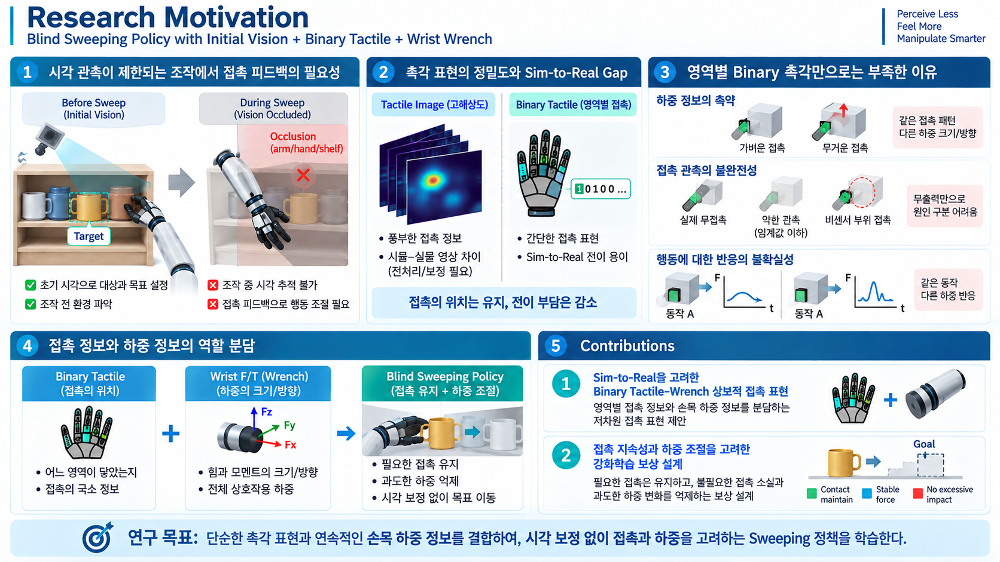

# 1. Research Motivation and Contributions

[발표 문서 안내](README.md) · [Related Works](02_Related_Works.md) · [Method](03_Method.md)

> **문서 상태: 연구 설계 초안.** 아래 Contribution은 제안하는 기여이며, 구현·실험으로 검증된 성과를 뜻하지 않는다.

## 1.1. 시각 관측이 제한되는 조작에서 접촉 피드백의 필요성

**물체 상태를 지속적으로 관측할 수 있다면, 조작 결과를 시각적으로 확인하며 보정할 수 있다. 하지만 조작 중 이러한 관측이 제한되면, 접촉 센싱을 통해 현재 상호작용을 해석하고 행동을 조절해야 한다.**

선반과 같은 제약 공간에서는 주변 물체와 구조물에 의해 시야가 제한된다. 여기에 조작을 수행하는 로봇 팔과 Hand의 가림이 더해지면서, 물체의 위치·자세를 지속적으로 추적하기 어려워진다. 따라서 초기 시각 관측으로 조작 대상과 목표를 결정한 이후에는, **연속적인 시각 보정에 의존하지 않는 접촉 기반 조작 능력**이 필요하다.

본 연구는 이러한 상황에서 **초기 시각 정보와 실시간 힘·촉각 피드백을 이용하는 Blind Sweeping 정책**을 제안한다. 시각은 초기 상태와 목표를 제공하고, 힘·촉각은 조작 중 발생하는 접촉과 하중 변화를 제공한다.

## 1.2. 촉각 표현의 단순화와 정보 손실

촉각 기반 조작에서는 **Tactile Image를 인코딩하여 접촉 분포와 변형 정보를 정책에 제공하는 접근**이 활용되어 왔다. 이 방식은 풍부한 접촉 정보를 제공하지만, **실제 센서 영상과 시뮬레이션 영상의 차이를 보정하는 과정**이 필요하다. 관련 사례와 비교는 [Related Works의 촉각 표현 절](02_Related_Works.md#22-tactile-정보를-활용하는-선행연구)에 정리한다.

이에 대한 다른 접근은 **촉각 정보를 센서 영역별 접촉 여부로 단순화하는 Binary 표현**이다. 정밀한 힘의 크기나 센서 내부의 세부 분포 대신 접촉의 유무를 전달하여, 촉각 신호의 Sim-to-Real Transfer를 단순화하는 방향이다.

**그러나 영역별 Binary 표현은 접촉 정보를 단순화하는 동시에, 하중의 크기와 방향에 관한 정보를 제거한다.** 어느 센서 영역이 닿았는지는 남지만, 그 접촉에 얼마나 큰 힘이 작용하는지, 어느 방향으로 힘이 작용하는지는 소실된다.

따라서 핵심은 **모든 촉각 정보를 최대한 축약하는 것**이 아니라, **단순한 관측 표현에서도 조작에 필요한 정보를 유지하는 것**이다.

## 1.3. 제한된 촉각 관측에서 보완할 정보

| 구분 | 센싱에서 발생하는 문제 | 보완하려는 정보 |
| --- | --- | --- |
| **하중 정보의 축약** | 같은 Binary 접촉 패턴에서도 하중의 크기·방향·변화가 다를 수 있지만, Binary 표현에는 이 차이가 나타나지 않는다. | 연속적인 Wrench 정보 |
| **접촉 관측의 불완전성** | 촉각의 무출력만으로는 실제 무접촉, 감지 임계값 이하의 약한 접촉, 비센서 부위의 접촉을 구분하지 못한다. | 다른 센서에서 얻는 접촉 단서 |

본 연구에서는 **촉각의 어떤 정보가 축약되거나 관측되지 않으며, F/T가 그중 무엇을 보완하는지**를 정의하고 실제 기여를 비교 실험으로 검증한다. F/T가 부족한 정보를 모두 복원하거나 접촉 상태를 유일하게 식별한다고 가정하지 않는다.

## 1.4. 연구 방향: 접촉 정보와 하중 정보의 역할 분담

**촉각에서는 영역별 접촉 정보를 유지하고, 하중 정보는 손목 F/T 센서에서 획득하는 역할 분담을 채택한다.** Binary 촉각은 접촉이 관측되는 Hand 영역을 제공하고, 손목 Wrench는 손목을 통해 전달되는 전체 힘과 모멘트를 제공한다.

이러한 역할 분담을 통해 정밀한 촉각 분포의 재현에 대한 의존도를 낮추면서, 촉각의 저차원화로 손실되는 하중 정보를 보완하는 방향을 제안한다. 연구의 대상은 촉각 영상이나 개별 접촉력을 복원하는 것이 아니라, 제한된 센싱으로 조작에 필요한 접촉·하중 정보를 제공하는 것이다.

연구의 목표는 모든 접촉 상태와 물체 물성을 완전히 복원하는 것이 아니다. 초기 정보 이후의 상호작용을 관측하고, **물체를 목표 방향으로 이동시키면서 필요한 접촉을 유지하고 적절한 하중을 인가하는 행동**을 학습하는 것이다.

> **연구 목표: 단순한 촉각 표현과 연속적인 손목 하중 정보를 결합하여, 시각 보정 없이 접촉과 하중을 고려하는 Sweeping 정책을 학습한다.**

## 1.5. 제안하는 Contributions

### 1.5.1. Sim-to-Real을 고려한 Binary Tactile–Wrench 상보적 접촉 표현

**영역별 Binary 촉각과 손목 Wrench가 접촉 정보와 하중 정보를 분담하는 저차원 접촉 표현을 제안한다.**

촉각에서는 어느 센서 영역이 접촉했는지를 유지하고, 손목 F/T에서는 전체 하중의 크기·방향을 획득한다. 이를 통해 정밀한 촉각 분포의 재현에 대한 의존도를 낮추면서, Binary화로 제거되는 하중 정보를 조작 정책에 제공한다.

### 1.5.2. 접촉 지속성과 하중 조절을 고려한 강화학습 보상 설계

**목표 달성과 함께 필요한 접촉의 지속성 및 하중의 안정성을 고려하는 보상 설계 방향을 제안한다.**

고정된 힘을 추종하거나 접촉력을 일괄적으로 최소화하는 대신, 조작에 필요한 힘은 허용하면서 불필요한 접촉 소실과 과도한 하중 변화를 억제한다. 촉각 센서의 활성 상태 자체가 아니라 **물체와의 실제 상호작용의 질**을 학습 목표로 두어, 제한된 접촉 관측 아래에서 안정적인 Sweeping을 유도한다.
