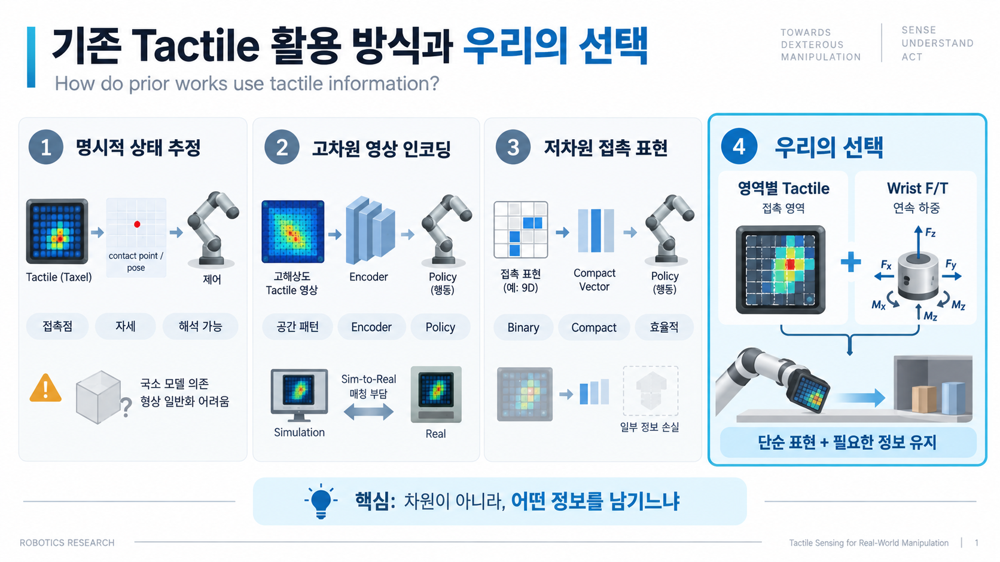
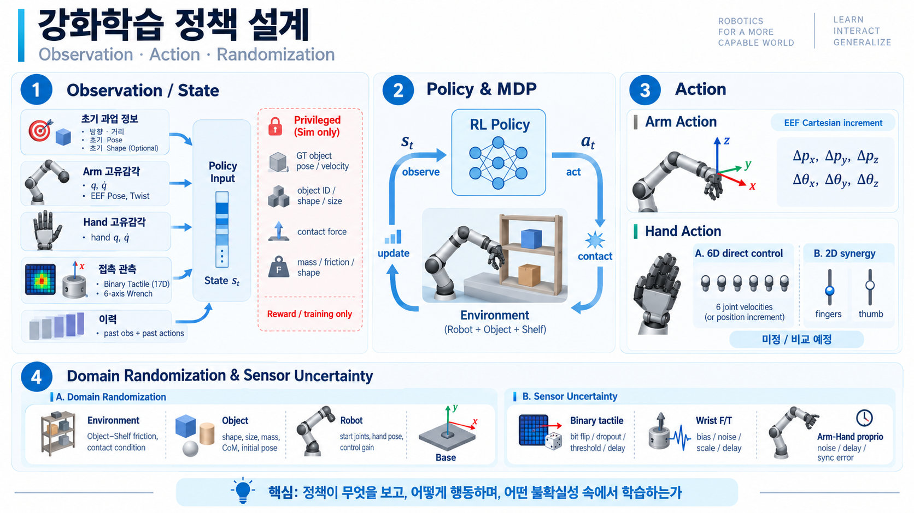

# 2. Tactile Representation and Sweeping Policy Design

[이전 문서: Research Motivation](01_Research_Motivation.md)

> **문서 상태: 연구 설계 초안.** 선행연구에서 확인된 내용과 본 연구의 설계 제안을 구분한다. 비교 근거가 확보되지 않은 항목은 **추가 조사 필요**로 남긴다.

## 2.1. 연구 질문

[첫 번째 문서](01_Research_Motivation.md)에서는 초기 시각 관측 이후 물체 상태를 지속적으로 갱신할 수 없는 상황에서, **영역별 Binary 촉각과 손목 F/T를 결합하는 Blind Sweeping**을 연구 방향으로 제시했다.

이 문서에서는 그 방향을 다음 질문으로 구체화한다.

> **기존 촉각 표현은 조작에 필요한 정보를 어떻게 제공하며, 본 연구의 제한된 촉각 관측에서 부족한 정보를 손목 Wrench와 행동·관측 이력으로 얼마나 보완할 수 있는가?**

연구의 목표는 모든 접촉 상태와 물체 물성을 완전히 복원하는 것이 아니다. 초기 정보 이후의 상호작용을 관측하고, **물체를 목표 방향으로 이동시키면서 필요한 접촉을 유지하고 적절한 하중을 인가하는 행동**을 학습하는 것이다.

따라서 **촉각의 어떤 정보가 축약되거나 관측되지 않으며, F/T가 그중 무엇을 보완하는지**를 정의하고 실제 기여를 비교 실험으로 검증한다.

---

## 2.2. 기존 연구는 Tactile 정보를 어떻게 사용하는가?

촉각 활용 방식은 **명시적 상태 추정**, **고차원 영상 인코딩**, **저차원 접촉 표현**의 세 방향으로 정리한다. 이어서 2.2.4절에서는 표현을 직접 비교한 연구를 통해, 어떤 정보를 남기거나 제거하는 것이 조작과 실물 전이에 유효했는지 살펴본다.

### 2.2.1. Contact Point·Pose·Shape 등을 명시적으로 추정하는 접근

이 접근은 촉각 신호를 바로 행동으로 연결하기보다, **접촉 위치·접촉면 자세·물체 자세와 같은 해석 가능한 상태로 변환한 뒤 제어에 활용**한다. 여기서는 각 연구가 실제로 추정하는 대상과, 제한된 관측에 대응하는 방법을 구분한다.

[**Max Yang et al. - Sim-to-Real Model-Based and Model-Free Deep Reinforcement Learning for Tactile Pushing**](../literature/papers/2023-yang-sim-to-real-tactile-pushing.md)는 센서 영상에서 **접촉 깊이와 각도**를 추정하고, 이를 로봇·목표 정보와 결합하여 밀기 정책 또는 동역학 모델의 입력으로 사용한다. 촉각의 국소 관측으로 물체 중심과 전체 형상·물성을 얻기 어렵기 때문에, **물체 전체 상태를 복원하는 대신 접촉면의 자세와 접촉 위치를 제어 대상으로 선택**한다. 접촉면에 수직으로 밀도록 정렬하면서 접촉 위치를 목표로 이동시킨다. 

[**John Lloyd and Nathan F. Lepora - Pose-and-shear-based tactile servoing**](../literature/papers/2024-lloyd-pose-and-shear-based-tactile-servoing.md)는 **접촉 자세와 접촉 이후의 Shear 변형**을 함께 추정한다. 이 연구는 미끄러짐 때문에 서로 다른 접촉·Shear 상태가 유사한 영상을 만드는 **Tactile aliasing**을 다룬다. 하나의 상태값만 출력하는 회귀 대신 **평균과 불확실성을 출력하는 Gaussian-density network(GDN)**를 사용하고, 로봇 운동학에 따른 시간적 예측과 **SE(3) Bayesian filtering**으로 결합한다.

[**Idil Ozdamar et al. - Pushing in the Dark: A Reactive Pushing Strategy for Mobile Robots Using Tactile Feedback**](../literature/papers/2024-ozdamar-pushing-in-the-dark.md)는 모바일 베이스의 정전용량 촉각에서 **대표 접촉점**을 계산한다. Taxel별 신호를 저역통과 필터와 임계값으로 처리한 뒤, 하나만 활성화되면 해당 Taxel의 위치를, 여러 개가 활성화되면 접촉 영역 **양 끝 Taxel 위치의 중점**을 사용한다. 물체의 Pose·형상·물성을 직접 복원하지 않고, 알려진 센서 배치와 Point/Line contact 근사를 이용하여 접촉을 하나의 제어 변수로 축약한다. 

 [**Pose-and-shear-based tactile servoing**](../literature/papers/2024-lloyd-pose-and-shear-based-tactile-servoing.md)에서는 제시하는 모델이 **평면 또는 완만한 곡면**을 중심으로 하기 때문에, 모서리와 같은 다른 표면 특징으로 확장할 때, 별도의 추정·제어 구성이 필요하다고 설명한다. 따라서 이러한 방법은 **촉각 영상에서 국소 상태를 안정적으로 추정하는 정확도와 동일한 접촉 모델을 다양한 표면 형상에 적용하는 것에 한계가 존재한다.**

### 2.2.2. 고차원 Tactile Image를 인코딩하여 사용하는 접근

이 접근은 **고차원 촉각 영상 또는 분포형 촉각을 영상 형태로 표현한 입력**을 Encoder로 처리하고, 생성된 특징을 정책에 제공한다. 접촉점이나 자세 하나로 먼저 축약하지 않고, 공간적인 접촉 패턴·변형·하중 분포를 행동 학습에 활용한다.

[**Yijiong Lin et al. - Tactile Gym 2.0: Sim-to-Real Deep Reinforcement Learning for Comparing Low-Cost High-Resolution Robot Touch**](../literature/papers/2022-lin-tactile-gym-2-0.md)는 TacTip, DIGIT, DigiTac을 같은 Sim-to-Real 방법론에서 비교한다. 실제 촉각 영상을 **시뮬레이션의 Depth-image 표현으로 변환하는 GAN**과 PPO 정책을 결합하여 Edge-following, Surface-following, Pushing을 수행한다.

[**Yijiong Lin et al. - Bi-Touch: Bimanual Tactile Manipulation With Sim-to-Real Deep Reinforcement Learning**](../literature/papers/2023-lin-bi-touch.md)는 두 TacTip 영상을 각각 **Real-to-Sim GAN**으로 변환하고, 영상 특징과 고유감각·목표 정보를 PPO 정책에 제공하여 양팔 밀기·재정렬·모으기를 수행한다. 

[**Dane Brouwer et al. - Gentle Object Retraction in Dense Clutter Using Multimodal Force Sensing and Imitation Learning**](../literature/papers/2026-brouwer-gentle-object-retraction.md)는 도구 양 측면의 분포형 3축 촉각을 **20×5×3 Force Image**로 표현하고, 촉각 전용 ResNet-18로 인코딩한다. 이 영상의 채널은 광학 촉각 카메라의 색을 관측한 것이 아니라 **측정된 힘 성분을 영상화한 표현**이다. 별도의 시각 Encoder와 TCP Pose·Wrench 등의 저차원 입력을 결합한 Diffusion Policy로 선반 인출을 수행하며, 센서 Ablation으로 분포형 촉각과 Wrench의 기여를 비교한다. 

[**Tactile Gym 2.0**](../literature/papers/2022-lin-tactile-gym-2-0.md)의 센서별 영상 변환과 [**Bi-Touch**](../literature/papers/2023-lin-bi-touch.md)의 접촉 동역학 수정 작업은 **고차원 촉각 표현은 공간적인 접촉 정보를 정책에 전달하는 데 유효하지만, 시뮬레이션 학습을 실물로 이전하려면 영상 표현과 실제 접촉 반응을 함께 대응**이 필요함을 보여준다. 

### 2.2.3. 촉각을 저차원으로 표현하는 접근

이 접근은 비교적 단순한 데이터 후처리를 통해 고차원의 촉각 영상을 단순화 하여 행동 학습에 활용한다. 가장 대중적으로 사용되는 방식을 Net Force가 Threshold 이상일 경우 접촉으로 판단하는 Binary식 표현이다.

[**Zihan Ding et al. - Sim-to-Real Transfer for Robotic Manipulation with Tactile Sensory**](../literature/papers/2021-ding-sim-to-real-tactile-manipulation.md)는 그리퍼 양쪽 Finger Pad의 **30개 저항식 촉각 Element**와 시뮬레이션 접촉 신호를 모두 Binary로 축약하고, TD3 관측에 넣어 문 열기를 학습한다. 연속 센서 응답을 정밀하게 일치시키는 대신 접촉 여부를 공통 표현으로 사용하는 방식이며, 실물에서 촉각 사용 여부에 따른 문 열기 성능 차이를 확인했다. 이 결과는 **Binary 촉각을 추가한 효과**를 보여준다.

[**Zhao-Heng Yin et al. - Rotating without Seeing: Towards In-hand Dexterity through Touch**](../literature/papers/2023-yin-rotating-without-seeing.md)는 손가락과 손바닥의 **16개 FSR 접촉 Bit**를 관절 위치·이전 제어 목표·회전축 및 **4-Frame 이력**과 함께 사용해 시각 없이 손 안의 물체를 회전시킨다. 시뮬레이션 접촉 힘과 실제 FSR 출력을 이진화하여 관측 표현을 맞춘다. 이 연구의 특징은 단순한 접촉 Bit를 단독으로 사용하는 것이 아니라, **접촉 영역과 손의 움직임·명령 이력을 결합**한다는 점이다. 

[**Kang-Won Lee et al. - DexTouch: Learning to Seek and Manipulate Objects With Tactile Dexterity**](../literature/papers/2024-lee-dextouch.md)는 손가락·손바닥의 **16개 FSR 신호를 부위별 Binary 접촉으로 변환**하고, 관절 상태·손바닥 Pose·손끝 위치·과업 사전정보와 함께 사용한다. PPO로 팔과 손을 함께 제어하여 물체 탐색·파지·운반, 문 열기, 밸브 회전을 과업별로 학습한다. 부위별 접촉 분포는 물체와 실제로 만난 위치를 행동에 반영하는 역할을 하며, 시뮬레이션 힘과 실물 전압의 정밀한 일치를 요구하지 않는 표현을 사용한다. 

[**Xinyuan Zhao et al. - Unknown Object Retrieval in Confined Space through Reinforcement Learning with Tactile Exploration**](../literature/papers/2024-zhao-unknown-object-retrieval.md)는 Tool Stick의 **4×4 Taxel, Taxel당 3축 촉각**을 **9차원 연속 특징**으로 축약한다. 구성은 열별 법선력 최댓값 4개, 열별 절댓값이 가장 큰 x축 전단력 값 4개, 전단력 이력의 FFT로 얻은 고주파 특징 1개다. 따라서 공간 분포를 축약하면서도 **하중 크기와 일부 전단·시간 정보를 유지**한다. 물체 Pose나 명시적인 물성 추정치를 입력하지 않고 이 특징만으로 실물 SAC 정책을 학습한다.

Tactile 정보를 저차원화 할 경우의 유의할 점은 **조작에 필요한 정보를 무엇까지 제거했는가**에 우유의하여야 한다.

#### 2.2.3.1. 촉각 표현을 직접 비교한 연구에서 얻는 근거

**같은 연구 안에서 표현을 바꾸어 비교한 결과**를 살펴본다. 특히 영상의 세부 표현을 단순화하는 것과, 접촉력을 Binary로 바꾸는 것을 구분한다.

[**Entong Su et al. - Sim2Real Manipulation on Unknown Objects with Tactile-based Reinforcement Learning**](../literature/papers/2024-su-sim2real-tactile-manipulation.md)는 DIGIT 촉각 영상을 **RGB·Diff·Binary**, 각각의 Augmentation 유무로 나누어 Pivoting 정책의 전이를 비교한다. 검토한 v1의 비증강 조건에서는 시뮬레이션 성공률이 유사했지만, 실물 성공률은 RGB 0.50, Diff 0.60, Binary 0.80으로 달랐다. 이 결과는 **영상 외형의 단순화가 실물 전이에 유효할 수 있다는 근거**를 제공한다.

[**Boya Zhang et al. - The Role of Tactile Sensing for Learning Reach and Grasp**](../literature/papers/2025-zhang-role-of-tactile-sensing.md)는 2-Finger Reach-and-Grasp에서 **측정량**과 **공간 해상도**를 분리하여 비교한다. 전역 Binary(B)·힘 크기(M)·3축 힘 벡터(V), 그리고 K개 국소 영역별 BK·MK·VK가 비교 대상이다. 정확한 시각 정보에서는 촉각의 추가 효과가 작았지만, 시각 Pose에 잡음이 있으면 특히 **V와 VK가 유효**했고 국소 VK에 전역 V를 함께 제공한 구성도 국소 정보만 사용하는 구성보다 좋았다. 

### 2.2.4. 결론

따라서 본 연구의 방향은 **모든 촉각 정보를 최대한 축약하는 것**이 아니라, **촉각으로 접촉 영역을 남기고 손목 F/T로 연속 하중을 추가하여, 단순한 관측 표현에서도 조작에 필요한 정보를 유지하는 것**이다. 

---

## 2.3. 본 연구에서 F/T를 추가하는 이유와 한계

### 2.3.1. F/T는 촉각을 대체하는 센서가 아니다

제안하는 역할 분담은 다음과 같다.

- **Binary 촉각:** 어느 감지 영역이 접촉했는지 제공
- **손목 Wrench:** 손목 센서를 통해 전달되는 전체 힘과 모멘트의 크기·방향·변화 제공
- **행동·고유감각 이력:** 이 관측이 어떤 명령과 실제 로봇 운동 이후 발생했는지 제공

> **추가 조사 필요:** 위 역할 분담을 직접 뒷받침하는 비교 근거는 별도로 조사한다. 현 단계에서는 F/T가 Binary 촉각의 부족한 정보를 모두 복원하거나 접촉 상태를 유일하게 식별한다고 주장하지 않고, 논리 구조만 유지한다.

---

## 2.4. Sweeping에서 중요하게 다뤄야 할 것은 무엇인가?

Sweeping에서 시스템 파라미터(Shape·질량·마찰·지지 조건 등)은 접촉 위치, 필요한 하중, 미끄러짐, 회전 등의 현실 움직임에 영향을 준다. 이러한 숨은 환경 조건에 대응하는 연구 방향은 다음 두 부류로 구분된다.

### 2.4.1. 명시적 모델의 작성

주변 환경이나 물체의 물성치를 별도 모델로 추정하고, 그 추정값을 계획 또는 정책에 제공한다.

(Reference 추가 필요)

### 2.4.2. 이력 기반 간접 적응 방향

관측·행동·반응의 시간 이력을 정책에 제공하여, 정책이 행동 선택에 필요한 환경 차이를 내부적으로 구분하도록 한다.

(Reference 추가 필요)

### 2.4.3. 결론

최종 Blind Actor는 실행 중 현재 물체 Pose나 정답 물성치를 받을 수 없고, 연구 목표도 물성치 자체의 정확한 복원보다 제한된 센싱으로 적절한 Sweeping 행동을 선택하는 것이기 때문에, **이력 기반 간접 적응 방향**을 사용한다.

추가적으로, 이력 기반 적응이 다양한 조건을 경험할 수 있도록 물체·환경·로봇 조건에 Domain Randomization을 함께 적용한다. Randomization은 강건성을 제공할 뿐 아니라, 정책이 구분해야 할 조건 변화를 학습 분포에 제공한다.

> **추가 조사 필요:** 명시적 환경 모델을 구축하는 연구와 이력으로 환경 파라미터에 간접 적응하는 연구를 각각 조사해 이 분류와 선택 근거를 보강한다. 이 TODO는 현재 저장소의 논문으로 임의 대체하지 않는다.

---

## 2.5. Markov Decision Process

### 2.5.1. State

| 구성        | Actor 입력 후보                                                            |
| --------- | ---------------------------------------------------------------------- |
| 초기 과업 정보  | 목표 방향·거리(Required), 초기 대상 Pose(Required), 제공 가능한 초기 크기·형상 정보(Optional) |
| Arm 고유감각  | 관절 위치·속도, EEF Pose·Twist                                               |
| Hand 고유감각 | 관절 위치·속도                                                               |
| 접촉 관측     | 영역별 Binary 촉각 후보 17차원, 보정된 6축 Wrench                                   |
| 이력        | 상기 정보들의 last information 혹은, sliding window                            |

#### 2.5.1.1. 이력 제공 입력

이력에는 영역별 Binary 촉각, 6축 Wrench, 실제 Arm·Hand 상태와 실제 적용 명령을 제공하는 것을 고려한다. 목표는 접촉 변화가 어떤 명령과 실제 운동 뒤에 발생했는지 연결하고, 현재 한 시점만으로 보이지 않는 환경 반응을 정책이 간접적으로 구분하도록 하는 것이다.

> **추가 조사 필요:** 이력으로 숨은 환경 파라미터에 적응하는 정책 구조와, Tactile Window·접촉 지속시간 표현의 근거를 별도로 조사한다.

#### 2.5.1.2. Privileged Information

시뮬레이션에서만 얻을 수 있는 일부 정보는, 최종 Blind Actor 입력에 포함하지 않는 대신에, Reward Formulation에서 활용 가능한 Privileged Information으로 사용할 수 있다.

- 현재 물체의 Ground-Truth Pose 및 속도
- 접촉 물체 ID(혹은, Shape이나 Size)
- 접촉력 벡터
- 정확한 질량·마찰·형상 파라미터 등

---

## 2.6. Action 설계

### 2.6.1. Arm Action은 Cartesian Space로 표현한다

정책의 Arm Action은 **EEF 기준 Cartesian Space의 운동 명령**으로 표현한다. 이는 정책 출력의 표현에 관한 결정이며, 실제 명령 변환 및 제어기 선택을 확정한 것은 아니다.

> **추가 조사 필요:** Joint-space Action 대비 Cartesian Action을 선택할 근거와, 현재 구현에서 실제 적용되는 Controller 경로를 확인한다.

### 2.6.2. Arm Action: Cartesian 증분을 생성한다

Arm의 기본 행동 후보는 EEF의 위치·회전 증분이다.

$$
a_t^{\mathrm{arm}}=(\Delta p_x,\Delta p_y,\Delta p_z,\Delta\theta_x,\Delta\theta_y,\Delta\theta_z).
$$

각 성분에는 물리 단위의 크기 제한을 적용하고 EEF 기준 좌표계를 일관되게 사용한다. 

### 2.6.3. Hand Action (미정)

Hand의 행동 표현은 아직 확정하지 않는다. 현재 비교할 후보는 6개 구동 입력을 직접 제어하는 방식과, 엄지와 나머지 손가락을 분리한 2차원 근사다. 여기서 6차원은 **Cartesian 6-DoF가 아니라 Hand의 구동 입력 차원**이다.

| 후보               | 행동 표현                                             | 표현 구조상 차이                              |
| ---------------- | ------------------------------------------------- | -------------------------------------- |
| **A. 6차원 직접 제어** | 각 구동부의 목표 또는 목표 증분                                | 부위별 접촉 조절 자유도를 유지하지만 탐색할 행동 공간이 커짐     |
| **B. 2차원 근사**    | $u_{\mathrm{fingers}},u_{\mathrm{thumb}}\in[0,1]$ | 나머지 손가락과 엄지의 자세 변화를 분리. 혹은 1차원 근사도 가능. |

> **추가 조사 필요:** Sweeping·비파지 조작에서 직접 관절 제어와 저차원 Hand Synergy를 비교한 연구.

---

## 2.7. Domain Randomization 설계

### 2.7.1. 사전 연구의 Domain Randomization

이미 검토한 RL 기반 연구에서는 물체·환경·로봇·센서 조건을 다양하게 무작위화하여 학습한다. 여기서는 **각 연구가 어떤 항목을 Randomization 했는지만 정리하며, 구체적인 수치 범위는 생략한다.**

| 연구 | Randomization 대상 |
| --- | --- |
| [**Rotating without Seeing**](../literature/papers/2023-yin-rotating-without-seeing.md) | 물체 질량·마찰·형상·초기 위치, Hand 마찰, PD Gain, 외력, 관절 관측 잡음, Action 잡음, Tactile Dropout·지연 |
| [**Beyond Binary**](../literature/papers/2026-pan-beyond-binary-cop-tactile.md) | 물체 질량·마찰, 물체·Hand 초기 Pose, Hand 초기 관절 상태·마찰, PD Gain, 관절 관측 잡음, Contact Force·Position 잡음, Contact Observation 지연 |
| [**Sim-to-Real Transfer for Robotic Manipulation with Tactile Sensory**](../literature/papers/2021-ding-sim-to-real-tactile-manipulation.md) | 손잡이 마찰, 문 경첩 Stiffness·Damping·Friction, 문·손잡이 질량, 환경 위치 Offset, Observation·Action 잡음, Observation 지연, Binary Tactile Bit Flip |
| [**DexTouch**](../literature/papers/2024-lee-dextouch.md) | 물체·문·밸브의 초기 위치, 물체·밸브의 초기 Orientation |
| [**Sim2Real Manipulation**](../literature/papers/2024-su-sim2real-tactile-manipulation.md) | 물체 형상·길이, 지지면 높이, 초기 물체 자세, 목표 자세 |

### 2.7.2. Randomization 대상 (후보)

| 구분            | Randomization 후보                                |
| ------------- | ----------------------------------------------- |
| **환경 파라미터**   | Object–Shelf 마찰, 선반 접촉 특성 등                     |
| **물체 파라미터**   | 종류·형상·크기·질량·질량 중심·초기 Pose 등                     |
| **로봇 파라미터**   | 시작 관절 상태·Hand 자세·제어 Gain(Stiffness & Damping) 등 |
| **Base 파라미터** | 선반에 대한 Base의 XY 평면 위치                           |

### 2.7.3. 센서 불확실성

2.7.2절의 환경·물체·로봇·Base 파라미터와 **별도로 센서 관측 오차를 모델링하고, 학습 중 해당 오차를 무작위화한다.** 물리 파라미터의 변화가 실제 접촉·운동을 바꾼다면, 센서 불확실성은 그 상태가 정책에 어떻게 측정·전달되는지를 바꾼다.

[2.7.1절](#271-사전-연구의-domain-randomization)의 Binary 반전·Dropout·지연 및 연속 접촉력 잡음 사례를 근거로, 본 연구에서는 다음 관측 오차 모델을 검토한다. **아래는 본 과업에 대한 설계 후보이며, 선행연구가 손목 F/T까지 동일하게 적용했다는 뜻은 아니다.**

| 대상 | 센서 불확실성 모델 후보 |
| --- | --- |
| **영역별 Binary 촉각** | 오검출(0→1), 접촉 누락(1→0), 감지 임계값의 변동, 관측 지연. 대칭 Bit Flip과 접촉 누락만 주는 Dropout을 구분 |
| **손목 6축 F/T** | 영점 Bias, 힘·모멘트 측정 잡음, 측정값 Scale 오차, 보정 후 남는 부하 오차, 관측 지연 |
| **Arm·Hand 고유감각** | 관절 위치·속도 등 실제 사용하는 관측의 잡음과 지연, 센서 간 시간 정렬 오차 |

Binary 촉각은 [**Sim-to-Real Transfer for Robotic Manipulation with Tactile Sensory**](../literature/papers/2021-ding-sim-to-real-tactile-manipulation.md)의 **매 Bit·매 Timestep 반전**을 구현 후보로 삼는다. 

## 2.8. Reward Formulation 설계

(Hmm...)