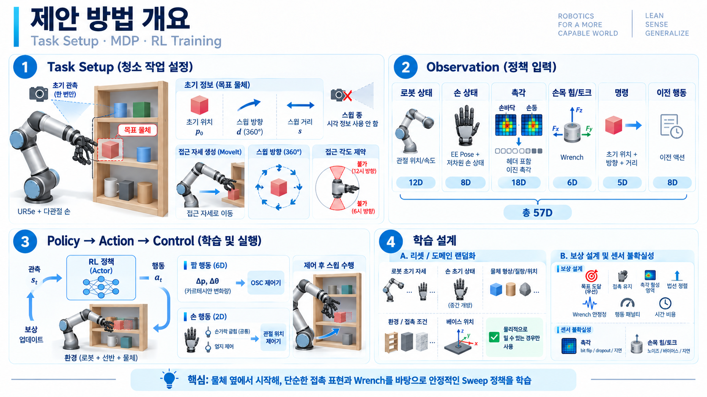

# 3. Method

[발표 문서 안내](README.md) · [Research Motivation and Contributions](01_Research_Motivation.md) · [Related Works](02_Related_Works.md)

> **문서 상태: 사용자 지정 설계에 따른 Method 초안.** MoveIt으로 접근한 뒤 접촉 기반 Sweeping 정책을 실행한다. 아래는 구현·성능 검증 결과가 아니라 현재의 입력·출력·초기화·보상 설계다. 보상식과 가중치, Noise·Randomization의 수치 범위는 추후 구체화한다.



## 3.1. Task와 실행 Process

### 3.1.1. 과업 입력과 수행 범위

타겟 물체의 **초기 Position**, **밀어야 하는 방향**, **밀어야 하는 거리**가 제공된다. Sweep 방향은 선반 평면에서 **360도 전 방향**을 허용한다. 초기 시각 정보는 사용하지만, 정책 실행 중 현재 물체 Pose를 시각으로 계속 갱신하지 않는다.

```text
초기 물체 위치 + Sweep 방향·거리
  → 사전 정의된 MoveIt 접근 계획·실행
  → 물체 옆의 도달 가능한 EEF Pose
  → 제안 정책의 Arm·Hand Action
  → Arm OSC + Hand Joint Position Controller
  → 나머지 Sweep 수행
```

MoveIt 접근은 **정책이 물체 옆에서 시작한다는 선행 조건을 만족시키는 절차**다. 접근 Planner 자체를 본 연구의 핵심 방법으로 다루거나, 접근까지 RL로 학습하는 범위로 확대하지 않는다. 접근 중에는 다른 물체로 인한 간섭이 없다고 가정한다.

### 3.1.2. MoveIt 접근과 도달 조건

EEF는 Hand에 고정된 기준점을 사용하며, **Hand 중앙 부근의 고정점**을 후보로 둔다. 정확한 기준점은 추후 정한다.

| 항목 | 도달 조건 |
| --- | --- |
| **Position** | 초기 타겟 위치에서 **Sweep 방향의 반대쪽으로 Offset을 둔 위치** |
| **Orientation** | 손바닥 Normal과 Sweep 방향이 평행하도록 정렬. 손바닥·손등 작업을 모두 허용하므로 손바닥 Normal 기준의 정방향·역방향 평행을 포함 |
| **Dead Zone** | 도달 자세를 정하는 각도 구역에서 **12시 부근 −30°~+30°**, **6시 부근의 60° 구간**을 제외 |
| **실제 Planning** | Dead Zone을 제외한 도달 가능한 영역에서 위 Position·Orientation 조건에 가장 유사한 Pose로 계획 |

**360도 허용은 Sweep Command의 방향 범위이고, Dead Zone은 접근 시 도달 Pose의 제한이다.** 두 조건을 같은 제한으로 취급하지 않는다. 12시·6시의 기준 좌표축, Offset 크기, Pose 유사도 기준과 도달 허용 오차는 아직 수치·구현 방식이 정해지지 않았다.

사전 정의된 접근 절차는 MoveIt 기반 Planner와 Controller로 실행한다. [**Samarth Brahmbhatt et al. - Zero-Shot Transfer of Haptics-Based Object Insertion Policies**](../literature/papers/2023-brahmbhatt-zero-shot-haptics-insertion.md)는 장애물이 없는 접근 경로를 가정하고 **MoveIt으로 목표 근처까지 이동한 뒤, 학습된 Controller로 접촉 구간을 수행**한다. 본 연구에서는 이 **접근과 접촉 정책의 분리**를 참고한다. 

<a id="31-markov-decision-process"></a>

## 3.2. Markov Decision Process

MDP의 **초기 상태 분포(Event), State/Observation, Action과 제어 경로, Reward**를 다음과 같이 구성한다. 실제 물체 상태와 접촉·물성 정보가 존재하는 물리 환경과, Actor에 제공되는 제한된 관측은 구분한다. Action을 제어기가 실행한 뒤의 물리적 상호작용이 다음 관측과 Reward로 연결된다.

### 3.2.1. Event — 초기 상태 분포와 Reset

학습 Episode는 MoveIt 접근이 끝난 것에 대응하는 **물체 옆의 유효한 상태**에서 시작한다.

| 대상 | 초기화·Randomization | 유효 조건 |
| --- | --- | --- |
| **Robot / Manipulator** | [3.1.2절](#312-moveit-접근과-도달-조건)의 도달 가능한 Pose를 기준으로 Noise를 반영하여 Initial Joint Configuration을 무작위화 | 한 자세에 고정하지 않고, 물체 옆의 다양한 도달 가능한 상태에서 Sweep을 시작 |
| **Hand** | 전체 손가락의 공통 굽힘 상태를 **Fully Closed = 0, Fully Open = 1**로 두고 **0.5 + Noise**로 초기화 | 정규화 범위 안에 있어야 하며, 손가락 자세로 인해 시작 전에 물체가 간섭받지 않는 위치·Configuration이어야 함 |
| **Object** | 큐브, 실린더, 몇 가지 비정형 물체를 사용. Shape·질량·위치를 다양화 | 실린더는 둥근 측면이 아닌 평평한 면으로 지지. 질량은 실제 선반 물체를 상정하되 구체적인 범위는 미정 |

모든 무작위화는 **명령된 방향으로 물체를 미는 것이 물리적으로 가능한 환경**에서만 유효하다. Noise로 도달 불가능한 자세나 초기 간섭, 밀 수 없는 물체 배치가 만들어진 경우는 유효한 Reset으로 사용하지 않는다.

물체 크기·마찰, 제어 Gain, Base 위치 등 기존 Randomization 후보는 [3.3절](#33-domain-randomization-설계)에 통합한다.

### 3.2.2. State / Observation

Actor 입력은 **현재 로봇·Hand 상태, 접촉 관측, 초기 Command, 직전 Action**으로 구성한다.

| 구성 | Actor 입력 | 차원 |
| --- | --- | ---: |
| **Robot** | Manipulator Joint Position 6 + Joint Velocity 6 | 12 |
| **Hand** | Sweep 시작 EEF Frame 기준의 현재 EEF 상대 Pose 6 + 저차원 Finger Joint 상태 2 | 8 |
| **Tactile** | 접촉면 Header 1 + 선택한 면의 Binary 접촉 17 | 18 |
| **F/T** | 현재 EEF Frame의 보정된 힘 3축 + 모멘트 3축 | 6 |
| **Command** | Sweep 시작 EEF Frame의 Initial Object Relative Position 3 + Direction 1 + Distance 1 | 5 |
| **Last Action** | 직전 Manipulator Action 6 + Hand Action 2 | 8 |
| **합계** | Last Action 제외 49차원, 포함 시 **57차원** | **57** |

EEF 상대 Pose는 주어진 차원에 맞춰 **Position 3 + Orientation 3**으로 둔다. Orientation의 구체적인 3성분 표현은 미정이며, 이 표에 EEF Twist나 Hand Joint Velocity를 추가하지 않는다. Direction은 Sweep 시작 EEF Frame에서 정의한 360도 방향을 나타내는 1개 값이며, 각도 기준·단위·정규화 방식은 구현 시 정한다.

Command의 물체 정보는 **초기 Position만** 제공한다. 현재 물체 Position·Orientation, 초기 Shape·Size는 이 Actor 입력 구성에 추가하지 않는다.

<a id="eef-relative-observation"></a>

#### 3.2.2.1. EEF-relative Task-space Observation

Task-space 관측은 Sweep 시작 시점의 EEF Frame을 $E_0$, 현재 EEF Frame을 $E_t$로 두고 **$E_0$ 기준의 상대량**으로 통일한다.

- 현재 EEF Pose는 절대 Base/World Pose가 아니라 $E_0$에서 본 $E_t$의 상대 Pose로 표현한다.
- 초기 물체 Position과 Sweep Direction은 $E_0$로 변환하여 Command에 제공한다. Distance는 좌표계 이동에 영향을 받지 않는 scalar다.
- 손목 Wrench는 센서 보정과 좌표 변환 후 현재 EEF Frame $E_t$에서 표현한다.
- Manipulator Action도 현재 EEF 기준 Cartesian 증분으로 출력한다.

공통 Global Frame $W$에서 Pose를 얻는 경우 상대 EEF Pose는 다음과 같다.

```math
{}^{E_0}\mathbf{T}_{E_t}=\left({}^{W}\mathbf{T}_{E_0}\right)^{-1}{}^{W}\mathbf{T}_{E_t}.
```

이 상대 표현은 **절대 Base 위치·방향의 공통 오차를 Actor 관측에서 별도 항으로 사용하지 않게 한다.** 따라서 정책이 특정 World/Base 좌표값을 외우는 것을 줄이고, 동일한 상대 접촉 과업을 Base 배치와 분리해 표현할 수 있다. 다만 실제 Base–선반 배치가 달라져 접근 가능 자세와 접촉 동역학이 바뀌는 현상, Robot kinematic calibration 오차, EEF extrinsic 오차와 이동 Base의 시간 변화까지 제거하는 것은 아니다. 이러한 물리적 차이는 [Domain Randomization](#32-domain-randomization-설계)과 실물 평가에서 별도로 다룬다.

#### 3.2.2.2. Hand의 2차원 상태

| 성분 | 의미 |
| --- | --- |
| **공통 굽힘 상태** | 모든 손가락의 굽힘 관절을 0~1로 정규화하여 표현하는 1차원. **0 = Fully Closed, 1 = Fully Open** |
| **엄지의 별도 관절 상태** | 엄지의 Palm 작업에 관여하는 별도 Joint를 0~1로 정규화한 1차원 |

두 번째 성분은 엄지의 별도 움직임이며, 전체 손가락의 공통 굽힘과 구분한다. 개별 관절에서 공통 굽힘 상태를 만드는 집계 방식과 정규화 관절 범위는 추후 구체화한다.

<a id="surface-conditioned-tactile"></a>

#### 3.2.2.3. 양면 촉각의 Binary 변환과 18차원 표현

센서 구성은 **전면 17개 저항식 Grid 영역 + 후면 17개 FSR**을 전제로 한다. 다음은 이 구성의 관측 설계이며, 실제 부착·영역 대응·감지 임계값이 검증되었다는 뜻은 아니다.

| 면 | 원시 구성 | 영역별 Binary 변환 |
| --- | --- | --- |
| **전면 / 손바닥** | 영역마다 여러 Cell을 가진 저항식 Grid | Grid에서 **한 Cell이라도 감지 임계값을 넘으면 1**, 모두 넘지 않으면 0 |
| **후면 / 손등** | FSR별 1차원 신호 | 접촉이 감지되면 1, 감지되지 않으면 0 |

손바닥과 손등의 같은 위치에 해당하는 영역을 1:1로 매핑하여 공통 17개 인덱스를 사용한다. 손바닥 작업에서 손등 측 관측은 모두 0이고, 손등 작업에서 손바닥 측 관측은 모두 0인 **단면 접촉 조건**을 전제로, 비선택 면의 데이터를 Actor 입력에서 생략한다.

기존 설계의 표기를 유지하여 손바닥·손등 Binary 벡터를 각각 $\mathbf{p}_t,\mathbf{d}_t$, 접촉면 Header를 $m_t$로 둔다.

```math
\mathbf{p}_t,\mathbf{d}_t\in\{0,1\}^{17},\qquad
m_t=\begin{cases}
0,&\text{palm-side sweep},\\
1,&\text{dorsal-side sweep}.
\end{cases}
```

```math
\mathbf{c}_t=(1-m_t)\mathbf{p}_t+m_t\mathbf{d}_t,\qquad
\mathbf{z}_t=[m_t,\mathbf{c}_t]\in\{0,1\}^{18}.
```

**18개 성분은 모두 0 또는 1**이다. Header는 어느 면을 사용하는지를 알려주며, 접촉 유무를 뜻하지 않는다. 선택한 면에서 현재 1인 센서만 추리는 것이 아니라 **고정된 17개 영역의 0과 1을 모두 전달**한다. Header는 현재 동작에서 지정한 접촉면을 표현하므로 접촉 전·접촉 소실 시에도 의미가 유지된다.

기존의 축약 근거와 검증 조건은 아래에 보존한다. 손목 6축 Wrench는 이 18차원 표현과 별도로 제공한다.

#### 3.2.2.4. Last Action

[3.2.3절](#323-action과-제어-경로)의 **Manipulator 6차원 + Hand 2차원**으로 이루어진 직전 정책 Action $a_{t-1}$을 관측에 포함한다. 

#### 3.2.2.5. Privileged Information

다음 정보는 필요에 따라 **학습 Reward 또는 평가용 정답**으로 사용할 수 있지만, 최종 Blind Actor 입력에는 추가하지 않는다.

- 현재 물체의 Ground-Truth Pose·속도
- 시뮬레이션의 접촉력 벡터

### 3.2.3. Action과 제어 경로

정책 출력은 **Manipulator 6차원 + Hand 2차원 = 총 8차원**이다.

| 대상 | Action | 실행 Controller |
| --- | --- | --- |
| **Manipulator** | EEF 기준 Cartesian 위치 증분 3 + 회전 증분 3 | **Operational Space Controller (OSC)** |
| **Hand** | 공통 손가락 굽힘 1 + 엄지의 별도 관절 1. 각 입력은 0~1 | **Joint Position Controller** |

```math
a_t^{\mathrm{arm}}=(\Delta p_x,\Delta p_y,\Delta p_z,\Delta\theta_x,\Delta\theta_y,\Delta\theta_z),\qquad
a_t^{\mathrm{hand}}=(u_{\mathrm{flex}},u_{\mathrm{thumb}}).
```

#### 3.2.3.1. Manipulator — Cartesian 증분과 OSC

6차원 Delta는 병진만이 아니라 **위치·회전 증분을 합친 것**이다. 기존 문서의 EEF 기준 좌표계와 각 성분의 물리 단위 크기 제한은 유지하고, OSC가 해당 운동 명령을 실행하도록 한다. Gain·Action Scale·제어 주기는 이번에 임의로 정하지 않는다.

OSC를 채택하는 이유는 **Sweep 중 다른 물체와의 접촉·충돌에 순응적으로 대응하여 안정성을 높이려는 것**이다. [**Zero-Shot Transfer**](../literature/papers/2023-brahmbhatt-zero-shot-haptics-insertion.md)

Cartesian 표현을 선택하는 기존 방향은 유지한다. Joint-space 대비 표현의 비교 근거와, 실제 코드에서 적용할 OSC 경로·파라미터는 별도로 확인해야 한다.

#### 3.2.3.2. Hand — 2차원 입력을 관절 목표로 변환

Observation에서 정의한 공통 굽힘과 엄지의 별도 움직임을 각각 0~1의 Action으로 출력한다. 공통 굽힘은 **0 = Fully Closed, 1 = Fully Open**이며, 각 입력을 대응하는 실제 Joint Position 목표로 매핑한 뒤 Joint Position Controller로 실행한다.

이는 관절별 자유 제어를 추가하는 것이 아니라 **정의된 두 제어 축을 실제 관절 목표로 변환하는 방식**이다. 관절별 매핑 범위와 엄지의 별도 관절 대응은 구현 시 구체화한다.

### 3.2.4. Reward Formulation — 설계 초안

**목표 도달 Reward가 지배적이어야 하며, 나머지는 안정적인 Sweep을 돕는 보조 항이다.** 세부 수식·Weight·임계값은 실험을 통해 구체화한다.

| 항목 | 유도하려는 행동 | 현재 설계 범위 |
| --- | --- | --- |
| **목표 도달** | 목표점과 현재 물체의 **Position Error가 작을수록 높은 보상** | 초기 물체 위치와 Command의 방향·거리로 목표점을 정함. 현재 물체 Position은 Privileged Information을 사용 |
| **접촉면 Normal 정렬** | 손바닥 또는 손등의 Normal이 Sweep 방향과 일치하도록 유도 | Pull·Push 동작을 모두 고려하므로 이 항이 지배적이거나 자세를 고정하는 제약이 되어서는 안 됨 |
| **Wrench** | 과도한 힘을 억제하고, 유효한 하중을 Sweep 방향과 연결하는 방안 검토 | 큰 힘에 대한 페널티를 후보로 둠. 불필요한 성분을 상쇄·보정한 뒤 미는 방향의 힘을 얻고 방향 정렬을 보상하는 방식은 **추가 구체화 필요** |
| **Contact** | 접촉 상태를 유지하고, 접촉한 Tactile 영역이 많을수록 보상 | 접촉 유지와 활성 영역 수를 구분하여 설계. 특정 Tactile에 가중치를 부여할 수도 있음. **접촉면 Header는 접촉 개수에 포함하지 않음** |
| **기타 보조 항** | 불필요한 Action을 억제하고 빠른 과업 완료를 유도 | Action 페널티·시간 비용 등의 구체식은 미정 |

Wrench의 상쇄·보정 대상과 계산 방법, 힘·모멘트 각 성분의 사용 방식은 정해지지 않았다. 단순히 방향 성분을 투영했다고 해서 순수한 미는 힘이나 개별 접촉력이 분리된 것으로 간주하지 않는다. 기존처럼 힘과 모멘트의 단위·정규화도 구분하여 검토한다.

접촉이나 법선 정렬을 유지하더라도 물체를 목표로 이동시키지 않으면 주목적을 달성한 것이 아니다. **보조 항을 얻기 위해 목표 이동을 방해하지 않도록**, 단순한 Weight 숫자뿐 아니라 실제 보상 기여에서 목표 도달 항이 중심이 되도록 조정한다.

목표 도달 Reward와 실제 실행 종료 판정은 별개다. 물체 목표 허용 오차·Episode 종료 조건은 아직 구체화하지 않으며, EEF 이동을 물체의 목표 달성으로 대체하지 않는다.

<a id="32-domain-randomization-설계"></a>

## 3.3. Domain Randomization 설계

초기 상태의 Event는 [3.2.1절](#321-event--초기-상태-분포와-reset)에 정리했다. 여기서는 그 조건에 더해 **기존 문서의 물리 파라미터·제어·Base·센서 불확실성 후보를 유지**한다. 선행연구가 무작위화한 항목은 [Related Works의 DR 비교](02_Related_Works.md#24-선행연구의-domain-randomization)를 참조한다.

### 3.3.1. 물체·환경·로봇·Base 파라미터

| 구분 | Randomization 대상 | 적용 조건 |
| --- | --- | --- |
| **환경** | Object–Shelf 마찰, 선반 접촉 특성 | 명령된 Sweep이 가능한 조건 |
| **물체** | 큐브·실린더·비정형 Shape, 크기·질량·질량 중심·초기 Pose | 실린더의 평평한 면 지지, 실제 선반 물체를 상정한 질량. 수치 범위는 미정 |
| **Manipulator** | MoveIt 도달 가능 Pose 주변의 Initial Joint Configuration, 제어 Gain(Stiffness·Damping) | Noise 이후에도 유효한 시작 상태 유지 |
| **Hand** | 공통 굽힘의 0.5 + Noise 초기화 | 0~1 범위, 초기 물체 간섭 없음 |
| **Base** | 선반에 대한 Base의 XY 평면 위치 및 회전 | 해당 배치에서도 접근과 Sweep이 가능해야 함 |

위 구성은 **물리적으로 미는 것이 가능한 범위 안에서 다양한 조건을 제공**하며, 구체적인 범위·분포·갱신 주기는 임의로 추가하지 않는다. Base의 회전이나 실행 중 이동도 추가하지 않는다.

### 3.3.2. 센서 불확실성

물리 파라미터와 **별도로 센서 관측 오차를 모델링하고 학습 중 무작위화**한다. 물리 파라미터가 실제 접촉·운동을 바꾸는 것과, 센서 오차가 그 상태의 측정·전달을 바꾸는 것을 구분한다.

| 대상 | 기존 센서 불확실성 모델 후보 |
| --- | --- |
| **영역별 Binary 촉각** | 오검출(0→1), 접촉 누락(1→0), 감지 임계값 변동, 관측 지연. 대칭 Bit Flip과 접촉 누락만 주는 Dropout을 구분 |
| **손목 6축 F/T** | 영점 Bias, 힘·모멘트 측정 잡음, Scale 오차, 보정 후 남는 부하 오차, 관측 지연 |
| **Robot·Hand 고유감각** | 현재 사용하는 Joint Position·Velocity, EEF Pose와 저차원 Hand 상태의 관측 오차·지연, 센서 간 시간 정렬 오차 |

Binary 촉각은 [**Ding et al. - Sim-to-Real Transfer for Robotic Manipulation with Tactile Sensory**](../literature/papers/2021-ding-sim-to-real-tactile-manipulation.md)의 **매 Bit·매 Timestep 반전**을 구현을 참조한다.

## 3.4. 기존 정책 개요도

<details>
<summary>수정 전 참고 이미지</summary>

아래 그림은 이전 설계의 참고 자료다. 현재 Observation 57차원·Action 8차원, 양면 촉각의 18차원 표현과 직전 Action 입력은 위 본문을 기준으로 한다. 그림의 이력·Hand Action 대안 등은 현재 설계와 다를 수 있으며, 원본 이미지는 수정하지 않았다.


</details>
