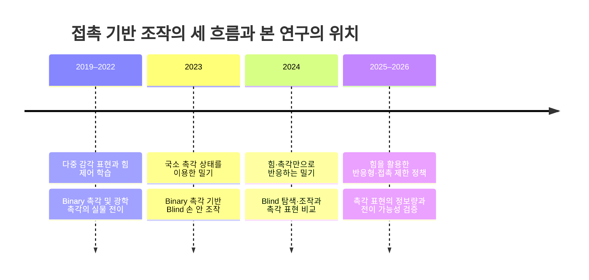

# Blind Sweeping 관련 연구: 타임라인·비교표·Contribution 초안

[발표 문서 안내](README.md) · [Related Works](02_Related_Works.md) · [Method](03_Method.md)

작성일: 2026-09-22 · **발표 구성 제안 / 성능 검증 전**

[33편 원문 검토 및 근거 부록](../literature/reviews/2026-09-22_related-work-five-axis-evidence.md)

## 1. 이 자료가 제안하는 논리

**접촉 피드백으로 시각 의존도를 낮추는 조작은 이미 가능하다. 남는 질문은, 영역별 Binary 촉각으로 접촉을 단순화했을 때 손실되는 하중 정보를 손목 Wrench가 보완하여, 물체의 현재 Pose를 받지 않는 Sweeping의 성능과 적용 범위를 넓힐 수 있는가이다.**

이 문서는 기존 `docs/literature/papers`의 33편을 모집단으로 삼는다. 그중 **동일 계열의 비파지 조작**, **유사한 실행 관측**, **센서 표현·전이의 직접 비교** 중 하나 이상을 제공하는 연구를 본문에 선택하고, 나머지와 원문 확인 상태는 부록에 남긴다. [Pose-and-Shear-Based Tactile Servoing (Lloyd & Lepora)](../literature/papers/2024-lloyd-pose-and-shear-based-tactile-servoing.md)은 추정·제어 대안, [Dynamic Object Goal Pushing (Dadiotis et al.)](../literature/papers/2025-dadiotis-dynamic-object-goal-pushing.md)과 [Location-Based Attention Pushing (Dengler et al.)](../literature/papers/2025-dengler-location-based-attention-pushing.md)은 현재 물체 관측을 유지하는 밀기의 대조군으로 부록에 배치한다. 따라서 아래 흐름은 **선택한 문헌의 연구지도**이며, 로봇 조작 분야 전체의 체계적 문헌조사나 신규성의 전수 검증은 아니다.

참고 발표 자료에서는 **전체 연대표 → 연도별 대표 연구 → 동향 정리 → 통합 비교표 → Contribution**의 구성을 차용했다. 다른 연구의 과업·평가 기준·성과는 가져오지 않았다. 논문들을 하나의 기술이 순차적으로 대체되는 역사로 묶지 않고, 같은 문제와 관련되는 여러 접근의 시간적 전개로 정리한다.

### 1.1. 현재 연구의 비교 기준

최신 저장소의 [Method](03_Method.md)와 [결정 목록](../03_DECISIONS_AND_OPEN_QUESTIONS.md)을 기준으로 한다.

| 항목 | 현재 설계와 비교 경계 |
| --- | --- |
| 과업 | 접근 완료 후, 대상 물체를 선반 평면의 지정 방향·거리로 미는 하위 정책. 방향은 360도 허용 |
| 초기 물체 정보 | **초기 Position만** 제공. 초기 Orientation·Shape·Size를 입력하지 않음 |
| 실행 중 물체 정보 | 현재 물체 Position·Orientation·속도와 주변 물체 GT를 Actor에 제공하지 않음 |
| 실행 중 로봇 정보 | 관절 위치·속도, EEF Pose, 저차원 Hand 상태, 직전 Action |
| 접촉 정보 | 지정 접촉면의 영역별 Binary 촉각 17 + 면 Header 1, 보정된 손목 6축 Wrench |
| 방법 | RL이 Arm 6차원 Cartesian 증분과 Hand 2차원 명령을 출력. Arm은 OSC로 실행 |
| 강건성·전이 | 학습 물체와 분리된 물체 평가, 센서·초기조건 변화, 실물 전이를 **검증할 계획** |
| 아직 성과로 주장할 수 없는 부분 | 실제 물체 목표 도달의 Blind 종료 판정, 단면 촉각 가정의 성립 범위, 결합 센서의 독립적 효과 |

이 문서는 새로운 Method를 확정하거나 기존 설계를 변경하지 않는다. 비교와 검증을 위한 제안이다.

### 1.2. 비교축의 권장 순서

| 순서 | 비교축 | 표에 적을 내용 |
| ---: | --- | --- |
| 1 | **Observation** | 실행 중 무엇을 받는가? 초기 정보, 실시간 외부 관측, 촉각 유도 추정, 로봇 고유감각을 구분 |
| 2 | **Sensor / Representation** | 어떤 물리 센서의 어떤 측정량을 어떤 표현으로 사용하는가? |
| 3 | **Method** | RL·IL·모델 기반 제어·규칙 제어와, 접촉 정보가 행동에 연결되는 방식 |
| 4 | **Robustness / Generalization** | 어떤 변화에 실제 평가했는가? 미학습 물체·물성 변화·초기오차·센서 변화 구분 |
| 5 | **Sim-to-Real Transfer** | 시뮬레이션에서 학습한 무엇을 실물에 옮겼으며, 실물 데이터·보정·추가학습이 필요한가? |

**Observation과 Sensor는 별도 축이다.** 카메라가 없는 것과 물체 상태를 모르는 것은 같지 않다. 광학 촉각 센서 내부 카메라는 외부 장면 시각과 구분한다. 손목 F/T, 관절 토크로 추정한 Wrench, 촉각 Taxel의 국소 힘도 같은 센서로 묶지 않는다.

---

## 2. 발표 1장: 연구 흐름의 전체 타임라인



| 연구 흐름 | 2019–2022 | 2023 | 2024 | 2025–2026 |
| --- | --- | --- | --- | --- |
| **힘·다중 감각을 행동에 연결** | [Making Sense of Vision and Touch (Lee et al.)](../literature/papers/2019-lee-making-sense-vision-touch.md), [Learning Force Control (Beltran-Hernandez et al.)](../literature/papers/2020-beltran-hernandez-learning-force-control.md), [Self-Tuning Haptic Exploration (Kato et al.)](../literature/papers/2022-kato-self-tuning-haptic-exploration.md) | [Zero-Shot Haptics Insertion (Brahmbhatt et al.)](../literature/papers/2023-brahmbhatt-zero-shot-haptics-insertion.md) | [Force Push (Heins & Schoellig)](../literature/papers/2024-heins-force-push.md) | [FORGE (Noseworthy et al.)](../literature/papers/2025-noseworthy-forge.md), [FoAR (He et al.)](../literature/papers/2025-he-foar.md), [Gentle Object Retraction (Brouwer et al.)](../literature/papers/2026-brouwer-gentle-object-retraction.md) |
| **외부 물체 관측 의존도를 줄인 조작** | [Tactile Gym 2.0 (Lin et al.)](../literature/papers/2022-lin-tactile-gym-2-0.md) | [Tactile Pushing (Yang et al.)](../literature/papers/2023-yang-sim-to-real-tactile-pushing.md), [Bi-Touch (Lin et al.)](../literature/papers/2023-lin-bi-touch.md), [Rotating without Seeing (Yin et al.)](../literature/papers/2023-yin-rotating-without-seeing.md) | [Pushing in the Dark (Ozdamar et al.)](../literature/papers/2024-ozdamar-pushing-in-the-dark.md), [DexTouch (Lee et al.)](../literature/papers/2024-lee-dextouch.md) | [Beyond Binary (Pan et al.)](../literature/papers/2026-pan-beyond-binary-cop-tactile.md) |
| **촉각 표현과 실물 적용** | [MAT (Wu et al.)](../literature/papers/2019-wu-mat-adaptive-tactile-grasping.md), [Sim-to-Real Transfer with Tactile Sensory (Ding et al.)](../literature/papers/2021-ding-sim-to-real-tactile-manipulation.md), [Tactile Gym 2.0 (Lin et al.)](../literature/papers/2022-lin-tactile-gym-2-0.md) | [Rotating without Seeing (Yin et al.)](../literature/papers/2023-yin-rotating-without-seeing.md) | [Sim2Real Tactile Manipulation (Su et al.)](../literature/papers/2024-su-sim2real-tactile-manipulation.md)의 Binary 접촉 영상 | [The Role of Tactile Sensing (Zhang et al.)](../literature/papers/2025-zhang-role-of-tactile-sensing.md), [Beyond Binary (Pan et al.)](../literature/papers/2026-pan-beyond-binary-cop-tactile.md) |

한 논문은 여러 흐름에 속할 수 있다. **행의 아래쪽이나 연도가 뒤쪽이라고 더 우수한 것은 아니다.** 이 지도는 다음 네 장에서 무엇을 설명할지 보여주는 목차다. 각 논문의 정식 제목·출판연도·원문 위치는 부록에 있다.

---

## 3. 발표 2장: 2019–2022 — 접촉을 정책 입력으로 활용하고 실물 적용을 시작

**슬라이드 핵심 문장: 힘·촉각을 학습에 쓰는 것과 촉각을 단순화하는 것은 이미 선행된 접근이다.**

| 대표 연구 | 한 일 | 비교에서 남겨야 할 조건 |
| --- | --- | --- |
| [**Making Sense of Vision and Touch (Lee et al.)**](../literature/papers/2019-lee-making-sense-vision-touch.md) | 시각·F/T·로봇 상태의 자기지도 표현을 만들고 접촉 조작 정책 학습에 사용 | 여러 감각을 결합하는 것 자체는 기존 접근. 실물 직접 학습을 Sim-to-Real로 표시하지 않음 |
| [**MAT (Wu et al.)**](../literature/papers/2019-wu-mat-adaptive-tactile-grasping.md) | 초기 시각으로 접근한 뒤 Binary 접촉·촉각 위치·관절 이력으로 파지 정책을 실행하고 미학습 물체에서 실물 전이 | **초기 시각 + Binary 촉각 + Blind RL + 일반화 + 전이**의 조합은 이미 존재 |
| [**Sim-to-Real Transfer with Tactile Sensory (Ding et al.)**](../literature/papers/2021-ding-sim-to-real-tactile-manipulation.md) | 30차원 Binary 촉각을 이용한 문 열기 정책의 실물 전이 | 실행 중 손잡이 상대 위치와 Hinge angle을 사용. **Binary 촉각 사용 ≠ 물체 상태 없이 실행** |
| [**Tactile Gym 2.0 (Lin et al.)**](../literature/papers/2022-lin-tactile-gym-2-0.md) | 광학 촉각 영상을 공통 Depth 표현으로 변환하여 RL 정책을 실물에 적용 | 실물 촉각 데이터를 이용한 GAN 학습 필요. 현재 물체 전체 Pose와 국소 촉각 관측은 구분 |

[Making Sense of Vision and Touch (Lee et al.) 원문 근거](../literature/reviews/2026-09-22_related-work-five-axis-evidence.md#p01) · [MAT (Wu et al.) 원문 근거](../literature/reviews/2026-09-22_related-work-five-axis-evidence.md#p02) · [Sim-to-Real Transfer with Tactile Sensory (Ding et al.) 원문 근거](../literature/reviews/2026-09-22_related-work-five-axis-evidence.md#p04) · [Tactile Gym 2.0 (Lin et al.) 원문 근거](../literature/reviews/2026-09-22_related-work-five-axis-evidence.md#p06)

### 3.1. 이 시기 접근들의 공통 한계

이 네 연구는 레이블 부족을 그대로 남겨 둔 것이 아니라, 자기지도 표현학습·Binary 추상화·도메인 랜덤화·실제-시뮬레이션 영상 변환으로 이를 우회했다. 따라서 공통 한계는 정답 레이블의 부재보다 다음 세 축으로 정리하는 편이 정확하다.

#### 1. 접촉·연성체 시뮬레이션의 Reality Gap

촉각 센서의 탄성체 변형, 비선형 마찰과 미세 접촉을 강체 중심 시뮬레이션에서 그대로 재현하기 어렵다. [Sim-to-Real Transfer with Tactile Sensory (Ding et al.)](../literature/papers/2021-ding-sim-to-real-tactile-manipulation.md)는 실제 전기 응답과 시뮬레이션 힘의 크기를 직접 맞추는 대신 수직력 근사와 Binary threshold를 사용했고, [Tactile Gym 2.0 (Lin et al.)](../literature/papers/2022-lin-tactile-gym-2-0.md)는 강체 접촉으로 렌더링한 Depth 영상에 실제-시뮬레이션 GAN과 센서별 전처리·카메라 보정을 추가했다. [MAT (Wu et al.)](../literature/papers/2019-wu-mat-adaptive-tactile-grasping.md)도 실물 신호의 평균화·threshold와 손가락 effort 보정으로 Binary contact를 맞췄다. 즉, 정책을 시뮬레이션에서 학습하더라도 실제 센서 보정이나 실물 데이터가 여전히 필요했다. 반면 [Making Sense of Vision and Touch (Lee et al.)](../literature/papers/2019-lee-making-sense-vision-touch.md)는 이 간극을 피하려고 실물에서 직접 정책을 학습했으며, 이는 아래의 실물 탐색 비용으로 이어진다.

#### 2. 고차원 데이터 처리와 정보 손실의 딜레마

입력을 그대로 사용하면 학습 부담이 커지므로 각 연구는 과업에 필요한 표현만 남겼다. 그러나 단순화 방식과 남은 제약은 서로 다르며, 모든 제약이 압축 하나 때문에 발생했다고 단정할 수는 없다.

| 연구 | 사용한 추상화·압축 | 남은 정보와 확인된 제약 |
| --- | --- | --- |
| [Making Sense of Vision and Touch (Lee et al.)](../literature/papers/2019-lee-making-sense-vision-touch.md) | RGB·F/T 이력·고유감각을 128차원 표현으로 융합하고 RL 중 encoder 고정 | 정책은 3D Cartesian 변위만 출력하고 실행 중 시각을 계속 사용. 6-DoF 확장은 Future Work |
| [MAT (Wu et al.)](../literature/papers/2019-wu-mat-adaptive-tactile-grasping.md) | Force magnitude를 Binary contact로 변환 | 96 taxel의 공간 분포·20시점 이력·FK 접촉 위치는 유지하므로 저차원 입력은 아님. Sparse tactile의 자세 정보와 충돌 위험 때문에 자세 조정은 wrist roll 중심으로 제한 |
| [Sim-to-Real Transfer with Tactile Sensory (Ding et al.)](../literature/papers/2021-ding-sim-to-real-tactile-manipulation.md) | 30개 taxel의 연속 응답을 Binary pattern으로 변환 | 접촉 위치 패턴은 유지하지만 하중 크기는 제거. 연속 tactile readout 활용은 Future Work이며, 현재 정책은 손잡이 상대 위치·hinge angle을 계속 관측 |
| [Tactile Gym 2.0 (Lin et al.)](../literature/papers/2022-lin-tactile-gym-2-0.md) | 실제 촉각 영상을 시뮬레이션 Depth-image 표현으로 변환 | 공간 영상은 유지하지만 실물 데이터·GAN·센서별 보정이 필요. 평평하고 뻣뻣한 DIGIT는 약한 접촉과 오목면에서 실패 |

#### 3. 하드웨어 취약성과 실물 탐색 비용

실물 학습은 접촉 모델의 부정확성을 피하지만 센서 충돌·마모, 안전 제한, 데이터 수집 시간과 동기화 지연을 부담한다. [Making Sense of Vision and Touch (Lee et al.)](../literature/papers/2019-lee-making-sense-vision-touch.md)는 실물 정책 학습에 300 episode와 약 5시간을 사용했다. [Sim-to-Real Transfer with Tactile Sensory (Ding et al.)](../literature/papers/2021-ding-sim-to-real-tactile-manipulation.md)는 반복 접촉에 의한 센서 손상과 RL 상호작용 비용을 문제로 제시해 시뮬레이션 학습을 택했다. [Tactile Gym 2.0 (Lin et al.)](../literature/papers/2022-lin-tactile-gym-2-0.md)도 영상 변환용 실물 데이터 수집에 약 6시간이 필요했고, DIGIT가 오목면에 걸리는 조건에서는 손상 방지를 위해 시험을 중단했다. Sim-to-Real은 실물에서의 자유로운 정책 탐색을 줄이지만, 실물 데이터 수집·보정·하드웨어 검증까지 제거하지는 않는다.

> **요약:** 촉각의 연성 접촉을 시뮬레이션이 충분히 재현하지 못하므로, 선행연구는 센서 입력을 압축·추상화하거나 별도의 변환 모델을 사용했다. 이 선택은 전이를 가능하게 했지만 하중 크기·자세 정보·적용 가능한 접촉 형상 중 일부를 잃거나 제한했고, 실물 보정과 하드웨어 비용도 남겼다.

**다음 장으로 연결:** 접촉을 추가하는 데서 더 나아가, 물체 전체의 상태를 지속해서 관측하지 않는 상황에서 조작할 수 있는지를 살펴본다.

발표 그림은 원문의 시스템 구성도와 실제 센서 사진을 우선한다. 논문당 설명은 **입력 → 방법 → 실제 평가 조건**의 세 줄로 제한한다. 위 표의 문장을 전부 슬라이드에 옮길 필요는 없다.

---

## 4. 발표 3장: 2023 — 국소 촉각으로 밀고, Binary 촉각으로 Blind 조작

**슬라이드 핵심 문장: 물체의 현재 Pose를 받지 않아도 국소 접촉 정보로 일부 조작을 수행할 수 있다.**

| 대표 연구 | 한 일 | 우리가 비교할 차이 |
| --- | --- | --- |
| [**Tactile Pushing (Yang et al.)**](../literature/papers/2023-yang-sim-to-real-tactile-pushing.md) | 촉각 영상에서 접촉 깊이·각도를 추정하고, 국소 접촉 상태와 로봇·목표 정보로 밀기 | 비파지 밀기의 근접 비교. **국소 접촉 상태를 추정하며 목표 도달도 접촉 위치 기준**; 물체 중심의 명령 변위와 구분 |
| [**Zero-Shot Haptics Insertion (Brahmbhatt et al.)**](../literature/papers/2023-brahmbhatt-zero-shot-haptics-insertion.md) | 초기 시각 목표 이후 EEF 상대 Pose·추정 Wrench 이력으로 SAC 보정과 OSC 실행 | **초기 시각 + Wrench RL + 실물 전이**의 직접 선행. 이미 파지한 물체의 슬롯 삽입 |
| [**Bi-Touch (Lin et al.)**](../literature/papers/2023-lin-bi-touch.md) | 두 촉각 센서의 영상과 고유감각·목표 정보를 이용해 양팔 조작 정책 실행 | 복수 접촉을 활용하지만 두 TacTip의 영상 변환과 양팔 접촉 구성이 전제 |
| [**Rotating without Seeing (Yin et al.)**](../literature/papers/2023-yin-rotating-without-seeing.md) | 16개 Binary 접촉과 로봇 관측 이력으로 시각 없는 손 안 회전 정책 전이 | **Binary 촉각 + Blind RL + 실물 전이**는 이미 존재. 손목 Wrench와 선반 Sweeping을 검증한 연구는 아님 |

[Tactile Pushing (Yang et al.) 원문 근거](../literature/reviews/2026-09-22_related-work-five-axis-evidence.md#p10) · [Zero-Shot Haptics Insertion (Brahmbhatt et al.) 원문 근거](../literature/reviews/2026-09-22_related-work-five-axis-evidence.md#p07) · [Bi-Touch (Lin et al.) 원문 근거](../literature/reviews/2026-09-22_related-work-five-axis-evidence.md#p09) · [Rotating without Seeing (Yin et al.) 원문 근거](../literature/reviews/2026-09-22_related-work-five-axis-evidence.md#p11)

### 4.1. 개별 논문에서 확인되는 한계

| 연구 | 수렴·전이를 위해 둔 설계 | 한계가 드러난 조건 |
| --- | --- | --- |
| [Tactile Pushing (Yang et al.)](../literature/papers/2023-yang-sim-to-real-tactile-pushing.md) | 접촉 깊이·각도를 추정한 pose 표현, 접촉 법선 정렬 reward, step당 $1\ \mathrm{mm}$의 고정 전진 | Pose 기반 방법은 여러 미지 물체에 전이했지만 image-based SAC는 학습 밖 변형을 보인 rubber duck의 부리 접촉과 $-20^\circ$ 초기 오차에서 접촉을 잃었다. 고정 전진은 가까운 목표로 급회전하거나 접촉면을 탐색하는 행동을 제한한다. |
| [Zero-Shot Haptics Insertion (Brahmbhatt et al.)](../literature/papers/2023-brahmbhatt-zero-shot-haptics-insertion.md) | 시작 전 target pose 1회 측정, target-pose noise curriculum, episode의 50%를 부분 삽입 상태에서 시작하는 reverse curriculum, residual action | Noise 범위를 넘는 큰 수평 초기 오차에서 성능이 낮았다. Base가 중심에서 크게 회전한 자세에서는 저자들이 OSC 관성 파라미터 식별 오차를 원인으로 추정했으며, 강한 충돌로 jammed된 뒤 복구하지 못한 사례가 있다. |
| [Bi-Touch (Lin et al.)](../literature/papers/2023-lin-bi-touch.md) | 실제 영상을 simulation-like 영상으로 바꾸는 GAN, 접촉 안정화 reward, 회전각 subgoal curriculum, gathering의 GUM과 물체 중심→TCP curriculum | 수정 전 회전 정책은 simulation sensor dynamics를 이용해 과도하게 압착하는 전략을 학습했다. 저자들은 sensor stiffness·damping과 penalty를 조정했지만 shear deformation은 여전히 모델링하지 않았다. 날카로운 triangular prism에서 slip 후 복구하지 못했고, 반복 외란에서는 큰 방향 전환 중 workspace를 벗어나는 실패가 증가했다. |
| [Rotating without Seeing (Yin et al.)](../literature/papers/2023-yin-rotating-without-seeing.md) | 실물 FSR 전압과 simulation contact force의 정합 부담을 줄이기 위한 16영역 Binary contact, 물체 중심·회전축 이탈 시 학습 episode 조기 reset | Binary 표현은 부위별 접촉 사건을 유지하지만 연속 force magnitude·방향·전단 분포를 제거한다. x·y축 회전에서 중요한 손가락 링크 측면 접촉을 센서 배치가 관측하지 못해 일부 물체의 성능이 제한됐다. 다만 이 연구는 z축 평면 회전에만 한정되지 않고 x·y·z축 회전을 모두 평가했으므로, 한계를 ‘평면 회전만 가능’으로 축약하지 않는다. |

### 4.2. 이전 시기 대비 진전

2023년의 네 연구는 **시뮬레이션에서 학습한 정책 또는 동역학 모델을 실물에서 추가 정책학습 없이 실행**할 수 있음을 서로 다른 과업에서 보였다. 다만 이 진전을 Isaac Gym·PyBullet 같은 물리 엔진의 발전만으로 설명할 직접 근거는 부족하다. 실제 성과는 관측 변환 모델, 센서 threshold 정합, domain randomization, controller 정합, curriculum과 과업별 reward를 결합한 결과다. 또한 zero-shot은 실물 정책 fine-tuning이 없다는 뜻이지, 실제 촉각 데이터·카메라 보정·초기 목표 계측·센서 보정까지 불필요하다는 뜻은 아니다.

### 4.3. 두 가지 구조적 병목

#### 1. 접촉·연성체 역학과 촉각 표현의 간극

세 촉각 중심 연구는 실물 센서의 연성 접촉을 그대로 재현하기보다 과업별로 필요한 정보를 선택했다. [Tactile Pushing (Yang et al.)](../literature/papers/2023-yang-sim-to-real-tactile-pushing.md)은 영상 또는 접촉 깊이·각도, [Bi-Touch (Lin et al.)](../literature/papers/2023-lin-bi-touch.md)는 실제-시뮬레이션 변환 영상, [Rotating without Seeing (Yin et al.)](../literature/papers/2023-yin-rotating-without-seeing.md)은 Binary contact pattern을 사용했다. 이 우회는 전이를 가능하게 했지만 다음 정보는 완전하게 다루지 못했다.

- [Bi-Touch (Lin et al.)](../literature/papers/2023-lin-bi-touch.md)는 simulation에서 shear deformation을 고려하지 않았고, 날카로운 접촉의 slip 복구에 실패했다.
- [Rotating without Seeing (Yin et al.)](../literature/papers/2023-yin-rotating-without-seeing.md)은 연속 하중 크기·방향·전단 분포를 정책 입력에서 제거했다.
- [Tactile Pushing (Yang et al.)](../literature/papers/2023-yang-sim-to-real-tactile-pushing.md)의 pose 표현은 불규칙 접촉에 image-based 방법보다 강했지만, 접촉 깊이·각도로 과업 관련 정보를 미리 선택한 표현이며 실제 데이터로 학습한 PoseNet이 필요했다.
- [Zero-Shot Haptics Insertion (Brahmbhatt et al.)](../literature/papers/2023-brahmbhatt-zero-shot-haptics-insertion.md)은 6축 Wrench를 사용하지만 국소 분포 접촉을 관측하지 않으며, 강한 jam에서 회복하지 못했다.

따라서 문제는 단순히 ‘촉각 정보가 부족하다’가 아니라, **전이가 쉬운 표현으로 추상화할수록 국소 하중·전단·미끄럼과 같은 복구 단서가 줄고, 풍부한 표현을 유지할수록 실제-시뮬레이션 정합 비용이 커지는 것**이다.

#### 2. 유도된 제약의 유효 범위와 좁은 수렴 영역

고차원 접촉 탐색을 수렴시키기 위해 네 연구는 강한 inductive bias를 사용했다.

| 연구 | 대표적인 유도 제약 |
| --- | --- |
| [Tactile Pushing (Yang et al.)](../literature/papers/2023-yang-sim-to-real-tactile-pushing.md) | 안정된 초기 접촉, 고정 전진, 접촉 법선 정렬 reward |
| [Zero-Shot Haptics Insertion (Brahmbhatt et al.)](../literature/papers/2023-brahmbhatt-zero-shot-haptics-insertion.md) | 초기 target pose, bounded noise curriculum, 50% 부분 삽입 초기화, residual motion |
| [Bi-Touch (Lin et al.)](../literature/papers/2023-lin-bi-touch.md) | GUM subgoal, 회전각 분할 curriculum, 물체 중심→TCP 정보 전환 curriculum, 접촉 안정화 reward |
| [Rotating without Seeing (Yin et al.)](../literature/papers/2023-yin-rotating-without-seeing.md) | 지지된 in-hand 축 회전, 물체 중심·축 이탈에 대한 학습용 early reset, 손끝 거리·회전 shaping |

이 제약은 결함이 아니라 탐색 공간을 줄여 학습을 성립시키는 설계다. 문제는 실제 상태가 설계된 수렴 영역을 벗어날 때다. 큰 초기 위치 오차, 로봇 작업영역 경계, 센서가 없는 측면 접촉, 날카로운 모서리의 slip, 강한 jam에서는 정책이 정상 접촉 상태로 돌아오지 못하거나 성능이 급격히 낮아졌다. 따라서 높은 성공률은 **어떤 초기조건·접촉 모드·작업영역 안에서 측정했는지**와 함께 해석해야 한다.

> **요약:** 2023년 연구들은 과업별 추상화와 강한 유도 제약을 결합해 zero-shot Sim-to-Real을 실현했다. 그러나 연성체·전단·미끄럼을 충분히 재현하지 못한 상태에서 관측을 단순화하거나 별도 변환기에 의존했고, 실제 상태가 설계된 접촉·초기조건·작업영역을 벗어나면 복구 성능이 약해지는 구조적 한계를 남겼다.

**다음 장으로 연결:** Binary 촉각이 가능한 표현이라는 사실은 출발점이다. 필요한 정보량과 힘 피드백의 역할을 별도로 비교해야 한다.

---

## 5. 발표 4장: 2024 — Blind 조작의 실현과 방법별 관측 조건

**슬라이드 핵심 문장: Blind 조작은 RL만의 결과가 아니며, 간단한 힘 피드백 제어도 강한 비교 기준이다.**

| 대표 연구 | 한 일 | 우리가 비교할 차이 |
| --- | --- | --- |
| [**Force Push (Heins & Schoellig)**](../literature/papers/2024-heins-force-push.md) | 초기 근사 위치, 로봇 위치와 평면 접촉력으로 미지 물체를 경로에 따라 밀기 | 형상·마찰 모델과 현재 물체 Pose 없이도 가능한 **비학습 제어**. 접촉점 경로 추종이며 물체 중심 위치 보장은 아님 |
| [**Pushing in the Dark (Ozdamar et al.)**](../literature/papers/2024-ozdamar-pushing-in-the-dark.md) | 모바일 로봇 촉각 배열에서 대표 접촉점을 구해 반응형 밀기 | 촉각 유도 접촉점–목표 거리를 사용. 손목 Wrench 결합이나 학습 기반 전이가 핵심이 아님 |
| [**DexTouch (Lee et al.)**](../literature/papers/2024-lee-dextouch.md) | Binary 촉각으로 탐색·파지·조작하며 시각 관측 없이 실물 정책 실행 | Binary 촉각만으로 접촉 탐색과 조작이 가능함을 인정. Sweeping에서 하중 정보의 추가 효과는 별도 질문 |
| [**Unknown Object Retrieval (Zhao et al.)**](../literature/papers/2024-zhao-unknown-object-retrieval.md) | 좁은 틈에서 9차원 연속 촉각만으로 SAC 회수 정책을 실물 학습하고 미학습 물체 평가 | **저차원 촉각-only RL과 일반화**도 선행됨. Binary 표현이나 Sim-to-Real을 검증한 결과는 아님 |
| [**Sim2Real Tactile Manipulation (Su et al.)**](../literature/papers/2024-su-sim2real-tactile-manipulation.md) | 촉각 RGB·차영상·Binary 접촉 영상을 비교하며 물체 Pivoting 정책 전이 | 여기서 Binary는 **공간 패턴을 남긴 64×64 영상**. 영역당 1bit와 같지 않음 |

[Force Push (Heins & Schoellig) 원문 근거](../literature/reviews/2026-09-22_related-work-five-axis-evidence.md#p13) · [Pushing in the Dark (Ozdamar et al.) 원문 근거](../literature/reviews/2026-09-22_related-work-five-axis-evidence.md#p17) · [DexTouch (Lee et al.) 원문 근거](../literature/reviews/2026-09-22_related-work-five-axis-evidence.md#p14) · [Sim2Real Tactile Manipulation (Su et al.) 원문 근거](../literature/reviews/2026-09-22_related-work-five-axis-evidence.md#p18) · [Unknown Object Retrieval (Zhao et al.) 원문 근거](../literature/reviews/2026-09-22_related-work-five-axis-evidence.md#p21)

### 5.1. 개별 논문에서 확인되는 한계

| 연구 | 성립을 위해 둔 전제·설계 | 한계가 드러나는 범위 |
| --- | --- | --- |
| [Force Push (Heins & Schoellig)](../literature/papers/2024-heins-force-push.md) | 로봇의 전역 Pose와 기준 접촉점, 추종할 경로를 알고 평면 접촉력 방향으로 비학습 제어. 힘이 임계값보다 작아지면 힘 방향 대신 로봇 위치와 경로 오차로 재접촉 방향을 생성 | 물체 중심이나 CoM을 직접 제어하지 않고 **접촉 기준점의 경로**를 추종하므로, CoM과 평가 위치가 어긋난 Box1에서는 측정 궤적이 경로에 일정한 offset을 남겼다. 접촉 소실 시 복구는 힘에 대해서만 open-loop이고 로봇 위치에는 closed-loop이지만, 준정적·볼록 단일 물체와 충분한 기동 공간 밖의 복잡한 slip·clutter에서는 검증되지 않았다. 안정성 증명과 더 정교한 재접촉도 후속 과제다. |
| [Pushing in the Dark (Ozdamar et al.)](../literature/papers/2024-ozdamar-pushing-in-the-dark.md) | 세계 좌표계의 로봇 Pose, 로봇 좌표계의 대표 접촉점과 목표점을 이용해 전진·횡이동·회전을 반응적으로 조절 | 현재 물체 Pose는 요구하지 않지만 **로봇 자기 위치 추정은 필수**다. 원통은 rolling이 생기고 상자형 물체의 line contact보다 성공률이 낮았으나, 이 원인은 별도 요인 실험으로 분리되지 않았다. 또한 물체의 최종 orientation과 장애물 회피는 다루지 않은 열린 공간 위치 운반이며 후속 과제로 남았다. |
| [DexTouch (Lee et al.)](../literature/papers/2024-lee-dextouch.md) | 16개 FSR 신호를 thresholding한 Binary contact와 로봇 고유감각, 목표·탐색 영역 prior로 비대칭 PPO 정책을 학습 | Binary 표현은 접촉 부위는 남기지만 연속 force magnitude를 제거하므로 섬세한 하중 조절 가능성을 제한한다. 다만 이 표현 손실이 개별 실패를 일으켰다는 직접 ablation은 없다. 정확한 물체 Pose 없이도 동작하지만 대략적인 2차원 탐색 범위가 필요하고, 학습 밖의 무겁고 미끄러운 tumbler에서는 성공률이 가장 낮아 미경험 물성에 대한 일반화 한계가 드러났다. |
| [Unknown Object Retrieval (Zhao et al.)](../literature/papers/2024-zhao-unknown-object-retrieval.md) | 물체가 이미 위치 확인되었다고 가정한 뒤, 9차원 연속 촉각과 수평 변위·후퇴 primitive를 사용하는 SAC를 실제 KUKA에서 직접 학습 | 물체를 찾는 search/localization 단계는 범위 밖이지만, 회수 중 접촉 위치를 바꾸는 탐색 행동은 후퇴 primitive로 수행한다. 행동은 수평면에 한정되고 경사·수직 공간은 후속 과제다. Sim-to-Real 접촉 오차를 피한 대신 실물 학습의 시간·마모 부담 때문에 직육면체와 원통 대표 형상에 집중해 약 5시간 학습했으며, 12개 미학습 물체에서 높은 성공률을 보였어도 임의 형상·물성에 대한 보편적 강건성을 뜻하지 않는다. |
| [Sim2Real Tactile Manipulation (Su et al.)](../literature/papers/2024-su-sim2real-tactile-manipulation.md) | 말단 행동을 $x$–$z$ 평면 병진과 $y$축 회전으로 제한하고 gripper 폭을 고정. RGB 대신 무접촉 기준과의 Diff 또는 픽셀별 Binary 접촉 패턴을 사용 | 제한된 행동 공간은 pivoting 정책의 수렴을 돕지만 일반 6-DoF 조작을 검증하지 않는다. Diff·Binary는 광학 domain gap을 줄이는 대신 RGB의 appearance와 Binary threshold 아래의 강도 정보를 버린다. Binary는 센서당 1bit가 아니라 64×64 공간 패턴을 유지한다. 불안정한 파지와 불완전·특이 접촉에서 실패했으며, soft table 성공률은 0.80에서 0.76으로 소폭 감소했지만 새로운 지지면에서 붕괴했다고 볼 정도는 아니다. |

두 비학습 제어 연구가 물체의 현재 Pose를 요구하지 않는다는 사실과 localization-free라는 주장은 구분해야 한다. 특히 [Pushing in the Dark (Ozdamar et al.)](../literature/papers/2024-ozdamar-pushing-in-the-dark.md)의 목표 변위는 다음과 같이 세계 좌표계의 로봇 위치와 방향을 직접 사용한다.

```math
\mathbf{d}=\mathbf{p}_T^W-\left(\mathbf{p}_R^W+\mathbf{R}_R^W\mathbf{p}_C^R\right).
```

따라서 이 식에서 제거된 것은 **물체의 온라인 전역 Pose 추적**이지, 로봇 자신의 전역 Pose 추정이 아니다. [Force Push (Heins & Schoellig)](../literature/papers/2024-heins-force-push.md)도 같은 구분이 필요하다. 실물 실험에서 Vicon은 로봇 base localization과 평가용 물체 궤적 기록에 쓰였고, 물체 Pose만 제안 제어기 입력에서 제외됐다.

### 5.2. 제어·학습 패러다임별 비교

| 패러다임 | 해당 연구 | 확인된 장점 | 구조적 병목 |
| --- | --- | --- | --- |
| **규칙·제어 기반** | [Force Push (Heins & Schoellig)](../literature/papers/2024-heins-force-push.md), [Pushing in the Dark (Ozdamar et al.)](../literature/papers/2024-ozdamar-pushing-in-the-dark.md) | 학습 데이터 없이 힘 방향 또는 접촉 위치의 물리적 의미를 즉시 반영하고, 현재 물체 Pose·상세 물성 모델 없이 운반 | 로봇 localization과 목표·경로가 필요하다. 접촉점 조절이 곧 물체 중심·orientation 제어는 아니며, rolling·CoM 편차·접촉 소실·clutter에서 복구 범위가 제한된다. |
| **Sim-to-Real 강화학습** | [DexTouch (Lee et al.)](../literature/papers/2024-lee-dextouch.md), [Sim2Real Tactile Manipulation (Su et al.)](../literature/papers/2024-su-sim2real-tactile-manipulation.md) | 대규모 simulation으로 접촉 탐색부터 다관절 조작 또는 pivoting까지 학습하고 실물 정책 fine-tuning 없이 실행 | 센서–simulation 차이를 줄이기 위해 threshold·Diff·Binary 표현과 과업별 action prior를 사용한다. 그 결과 하중 크기나 광학 세부가 줄고, 탐색 영역·고정 gripper·제한 DoF·학습 물성 범위 밖에서 취약성이 남는다. |
| **실환경 직접 강화학습** | [Unknown Object Retrieval (Zhao et al.)](../literature/papers/2024-zhao-unknown-object-retrieval.md) | 실제 접촉 신호로 학습해 접촉 simulation의 reality gap을 우회하고, 미학습 생활 물체에도 추가 학습 없이 적용 | 시간과 hardware wear 때문에 대표 형상, 수평 confined-space 과업, parameterized primitive와 curriculum에 집중해야 했다. 학습 reward에는 OptiTrack 변위가 필요했으며 search/localization과 경사·수직 조작은 해결 범위 밖이다. |

이 비교에서 공통 병목은 단순히 “규칙 기반인가 RL인가”가 아니다. 규칙 기반은 해석 가능하고 데이터가 필요 없지만 robot localization과 접촉 기하 가정에 묶이고, Sim-to-Real RL은 복잡한 행동을 얻는 대신 표현 단순화와 학습 분포에 묶이며, 실환경 RL은 simulation 오차를 제거하는 대신 hardware 비용 때문에 과업·형상·행동을 좁혀야 한다.

> **요약:** 2024년 연구들은 물체의 현재 Pose 없이도 힘·접촉 위치·Binary 또는 저차원 연속 촉각으로 Blind 조작이 가능함을 보였다. 그러나 비학습 제어는 로봇 localization과 접촉점 중심의 목표 정의에, Sim-to-Real RL은 정보 추상화와 과업별 행동 제약에, 실환경 RL은 hardware 비용과 제한된 학습 범위에 의존한다. 따라서 미지 물체 강건성은 성공률 하나가 아니라 **어떤 localization·초기조건·물성·접촉 모드·DoF 안에서 복구했는지**로 비교해야 한다.

**다음 장으로 연결:** 핵심은 시각을 없앴다는 사실보다, **어떤 접촉 정보를 남겼을 때 어떤 과업과 변화에 대응하는가**이다.

---

## 6. 발표 5장: 2025–2026 — 남겨야 할 정보와 힘 피드백의 활용

**슬라이드 핵심 문장: 촉각의 정보량은 과업에 따라 중요하며, 힘·촉각을 함께 쓴다는 사실만으로 새로운 기여가 되지는 않는다.**

| 대표 연구 | 한 일 | 우리가 비교할 차이 |
| --- | --- | --- |
| [**The Role of Tactile Sensing (Zhang et al.)**](../literature/papers/2025-zhang-role-of-tactile-sensing.md) | 촉각의 공간 해상도와 측정량을 분리해 비교 | 정확한 물체 관측과 잡음 있는 관측에서 촉각의 효과가 다름. 손가락 합력과 손목 Wrench는 다름 |
| [**FORGE (Noseworthy et al.)**](../literature/papers/2025-noseworthy-forge.md) / [**FoAR (He et al.)**](../literature/papers/2025-he-foar.md) | 힘 제한으로 조건화한 RL / 접촉 예측을 결합한 반응형 IL | 힘을 이용한 정책 조절도 선행 접근. 전자는 **고정부의 noisy Pose와 추정 3D 힘**을 사용하되 파지부 현재 Pose는 미제공. 후자는 실행 중 시각 사용 |
| [**Gentle Object Retraction (Brouwer et al.)**](../literature/papers/2026-brouwer-gentle-object-retraction.md) | 시각·촉각 힘 분포·추정 Wrench를 융합해 밀집 환경에서 물체 회수 | 환경과 하중 측면의 근접 문헌. 실행 시각과 연속 촉각을 사용하는 실물 IL이라는 조건을 보존 |
| [**Beyond Binary (Pan et al.)**](../literature/papers/2026-pan-beyond-binary-cop-tactile.md) | 국소 접촉 위치와 하중을 보존하는 CoP 표현을 Binary·Raw taxel과 비교. 실물 정책은 **국소 법선 하중** 사용 | **Binary의 정보 부족을 보완한다는 문제의식도 선행됨.** 본 연구는 손목 전체 하중을 이용하는 역할 분담의 효과를 검증해야 함 |

[The Role of Tactile Sensing (Zhang et al.) 원문 근거](../literature/reviews/2026-09-22_related-work-five-axis-evidence.md#p30) · [FORGE (Noseworthy et al.) 원문 근거](../literature/reviews/2026-09-22_related-work-five-axis-evidence.md#p28) · [FoAR (He et al.) 원문 근거](../literature/reviews/2026-09-22_related-work-five-axis-evidence.md#p26) · [Gentle Object Retraction (Brouwer et al.) 원문 근거](../literature/reviews/2026-09-22_related-work-five-axis-evidence.md#p31) · [Beyond Binary (Pan et al.) 원문 근거](../literature/reviews/2026-09-22_related-work-five-axis-evidence.md#p32)

[Beyond Binary (Pan et al.)](../literature/papers/2026-pan-beyond-binary-cop-tactile.md)는 검토한 **2026 arXiv 사전공개본**으로 표시한다. [Gentle Object Retraction (Brouwer et al.)](../literature/papers/2026-brouwer-gentle-object-retraction.md)은 정규 권호 기준 2026이며 온라인 공개·DOI 연도와 구분한다.

---

## 7. 발표 6장: 선행연구를 종합하면 남는 질문

| 원문에서 확인되는 사실 | 이 사실만으로 해결되었다고 볼 수 없는 질문 |
| --- | --- |
| 물체 전체 Pose 없이 힘 또는 촉각으로 미는 제어가 존재 | 다지 Hand의 불확실한 접촉에서도 같은 관측·제어로 명령 거리를 안정적으로 달성하는가? |
| Binary 촉각 기반 Blind RL과 실물 전이가 존재 | 같은 접촉 비트에서 달라지는 하중에 대응할 때 Wrench가 실제 이득을 주는가? |
| 국소 접촉 위치·하중을 보존하는 표현이 Binary보다 유리한 과업이 존재 | 국소 힘 배열 대신 Binary 영역 + 손목 전체 Wrench로 어느 수준까지 대체 가능한가? |
| 시각·촉각·Wrench를 결합한 조작이 존재 | 실행 시각과 현재 물체 Pose 입력을 제거한 뒤에도 결합 효과가 유지되는가? |
| 새로운 물체·초기조건·물성을 평가한 연구가 존재 | 우리 센서 구성과 Sweeping의 Train/Test 분리 조건에서 같은 효과가 유지되는가? |

**선택한 문헌에서 직접 검증되지 않은 조합이 있다는 사실은 연구 질문을 만든다. 그것만으로 알고리즘 신규성이나 우수성이 입증되지는 않는다.**

발표에서는 “기존 연구는 모두 부족하다” 대신 다음과 같이 연결한다.

> 선행연구는 힘 또는 촉각을 이용한 Blind 조작과 실물 전이의 가능성을 보여주었다. 그러나 센서 표현과 과업에 따라 필요한 정보가 달라진다. 본 연구는 물체의 현재 Pose가 없는 Sweeping에서, 영역별 Binary 촉각과 손목 Wrench의 상보성이 실제 행동 성능에 어떻게 기여하는지 검증한다.

---

## 8. 발표 7장: 통합 비교표

**기호:** `정책 전이`는 시뮬레이션 정책의 실물 실행, `직접 실물`은 실물 학습·제어 평가, `제안`은 본 연구의 미검증 목표다. 실물 데이터로 학습한 센서 변환·Calibration은 정책 재학습과 구분한다. `다양한 물체`를 모두 동일한 Held-out 검증으로 읽지 않는다.

| 연구 / 과업 | Observation: 실행 시 물체 정보 | 센서·표현 | Method | 강건성 검증의 대상 | Sim-to-Real |
| --- | --- | --- | --- | --- | --- |
| [**MAT (Wu et al.)**](../literature/papers/2019-wu-mat-adaptive-tactile-grasping.md) / 파지 | 초기 시각 접근; 실행 중 물체 Pose 없음 | Binary taxel + FK 접촉 위치·관절 이력 | Soft PPO | 미학습 물체·Clutter·초기오차 | 정책 전이; 실물 접촉 보정 |
| [**Zero-Shot Haptics Insertion (Brahmbhatt et al.)**](../literature/papers/2023-brahmbhatt-zero-shot-haptics-insertion.md) / 삽입 | 초기 목표 + EEF 상대 Pose 이력 | 추정 6축 Wrench + 로봇 상태 | SAC + OSC | 다른 접시·컵·방해물; 일부 Z offset | 정책 전이; 지연 정합 |
| [**Tactile Pushing (Yang et al.)**](../literature/papers/2023-yang-sim-to-real-tactile-pushing.md) / 밀기 | 전체 Pose 대신 국소 접촉 자세; 접촉 위치 목표 | TacTip 영상 → 접촉 깊이·각도 | 모델 기반 RL / 모델 없는 RL | 물체 형상·물성 및 외란 | 정책 전이; 실물 관측모델 학습 |
| [**Rotating without Seeing (Yin et al.)**](../literature/papers/2023-yin-rotating-without-seeing.md) / 손 안 회전 | 현재 물체 Pose 없음; 로봇·접촉 이력 | 16영역 Binary FSR | PPO | 여러 실물 물체·외란 | 정책 전이; DR·센서 전처리 |
| [**Force Push (Heins & Schoellig)**](../literature/papers/2024-heins-force-push.md) / 밀기 | 초기 근사 위치; 접촉점 경로 추종 | 손목 F/T의 평면 힘 | 힘 기반 조향·접촉 복구 제어 | 다양한 물체·마찰·경로 | 직접 실물; 학습 전이 해당 없음 |
| [**DexTouch (Lee et al.)**](../literature/papers/2024-lee-dextouch.md) / 탐색·조작 | 초기 위치 범위; 현재 물체 Pose 없음 | 다영역 Binary 촉각 + 로봇 상태 | PPO | 여러 물체·위치 불확실성 | 정책 전이; 초기조건 무작위화 |
| [**Unknown Object Retrieval (Zhao et al.)**](../literature/papers/2024-zhao-unknown-object-retrieval.md) / 회수 | Actor에는 촉각 특징만; 물체 Pose 없음 | 9D 연속 국소 촉각 | SAC | 미학습 물체·상황 | 직접 실물 RL |
| [**FoAR (He et al.)**](../literature/papers/2025-he-foar.md) / 도구 조작 | 실행 중 RGB-D 장면 관측 | 영상 + 6축 F/T 이력 | IL + 접촉 예측·행동 보정 | 새 그림·보드 위치·복합 외란 | 직접 실물 시연 학습 |
| [**Gentle Object Retraction (Brouwer et al.)**](../literature/papers/2026-brouwer-gentle-object-retraction.md) / 밀집 회수 | 실행 중 손목 영상 | 연속 촉각 힘 분포 + 추정 Wrench | Diffusion Policy 기반 IL | 미학습 환경 배치 | 직접 실물 시연 학습 |
| [**Beyond Binary (Pan et al.)**](../literature/papers/2026-pan-beyond-binary-cop-tactile.md) / 삽입 | 현재 물체 Pose 없음; 로봇 상태 | 촉각 유도 CoP·국소 법선 하중 | Recurrent PPO | OOD 초기조건·센서 손상 | 정책 전이; 센서·구동계 보정 |
| **본 연구 / Sweeping** | **초기 Position만; 실행 중 물체 Pose 없음** | **영역별 Binary + 손목 6축 Wrench** | **RL + OSC** | **미학습 물체·접촉조건: 검증 예정** | **검증 예정** |

각 행의 원문은 위 연도별 절과 부록에서 연결된다. 실제 1장 슬라이드에는 [Tactile Pushing (Yang et al.)](../literature/papers/2023-yang-sim-to-real-tactile-pushing.md)·[Force Push (Heins & Schoellig)](../literature/papers/2024-heins-force-push.md)·[DexTouch (Lee et al.)](../literature/papers/2024-lee-dextouch.md)·[Unknown Object Retrieval (Zhao et al.)](../literature/papers/2024-zhao-unknown-object-retrieval.md)·[Gentle Object Retraction (Brouwer et al.)](../literature/papers/2026-brouwer-gentle-object-retraction.md)·[Beyond Binary (Pan et al.)](../literature/papers/2026-pan-beyond-binary-cop-tactile.md)·본 연구의 7행을 우선 사용하고, [MAT (Wu et al.)](../literature/papers/2019-wu-mat-adaptive-tactile-grasping.md)·[Zero-Shot Haptics Insertion (Brahmbhatt et al.)](../literature/papers/2023-brahmbhatt-zero-shot-haptics-insertion.md)·[Rotating without Seeing (Yin et al.)](../literature/papers/2023-yin-rotating-without-seeing.md)·[FoAR (He et al.)](../literature/papers/2025-he-foar.md)는 설명 또는 보조표로 둔다. 표는 과업이 다른 논문 사이의 성공률 순위를 매기지 않는다. 상세 관측 구성·실물 데이터 사용·한계는 부록에서 확인한다.

**강조할 셀은 우리 행의 Observation과 센서 역할 분담이다.** 강건성과 Sim-to-Real에 성공 표시를 붙이거나, 타 연구의 직접 실물 검증을 실패 표시로 바꾸지 않는다.

---

## 9. 발표 8장: 제안하는 Contribution

### 9.1. 발표에 사용할 핵심 문장

> **초기 물체 위치 이후 시각적 상태 갱신 없이 수행하는 Sweeping에서, 영역별 Binary 촉각과 손목 Wrench를 결합한 접촉 정책을 제안한다. 접촉 영역 정보와 전체 하중 정보의 역할을 분리해 비교하고, 이 결합이 불확실한 접촉 및 미학습 물체 조건에서 제공하는 이득과 한계를 검증하고자 한다.**

현재 단계에서는 `제안한다 / 검증하고자 한다`를 사용한다. 결과가 확보된 후에만 실제 개선량·적용 범위를 넣어 `보였다`로 바꾼다.

| Contribution 후보 | 기존 연구와 연결되는 차이 | 이 주장을 성립시키는 증거 |
| --- | --- | --- |
| **C1. Binary 접촉 영역과 손목 하중을 결합한 Sweeping 정책** | 국소 촉각 상태 추정, Binary-only 정책, Force-only 제어 사이에서 전체 하중 보완의 효과를 평가 | 동일 조건의 접촉센서 없음 / Binary-only / F/T-only / 결합 비교, 유효한 규칙 기반 제어와 비교 |
| **C2. 센서 정보의 상보성과 한계에 대한 실험적 분석** | 센서를 추가했다는 사실을 넘어, 어느 접촉조건에서 어느 정보가 필요한지 설명 | 초기 접촉 편차, 센서 사각지대, 약한 신호, 접촉은 같고 하중이 다른 조건별 분석 |
| **C3. 미학습 물체와 실물에서의 유지 범위 검증** | 조합의 장점이 학습 환경에 한정되는지 평가 | 물체 단위 Train/Test 분리, 조건별 결과, 실물 보정·추가학습 내역과 실패 공개 |

석사 연구의 핵심 기여는 **C1 + C2**로 두는 편이 명확하다. C3는 반드시 확인할 평가 축이지만, 독립적인 전이 방법을 제안하지 않았다면 “새로운 Sim-to-Real 알고리즘”으로 분리해 부르지 않는다.

### 9.2. 보상 설계는 어떻게 주장할 것인가

목표 진행, 접촉 유지, 과도한 하중 억제의 항목을 더하는 것만으로 강한 신규성을 주장하기는 어렵다. 기존 [Motivation](01_Research_Motivation.md)의 보상 Contribution은 다음 조건이 확인될 때 보강할 수 있다.

- 접촉 보상·하중 보상이 어떤 실패를 줄이기 위해 필요한지 정의한다.
- 같은 관측·훈련조건에서 해당 보상항을 제거했을 때의 변화를 비교한다.
- 촉각 활성 영역 수가 증가한 것과 실제 물체 조작이 개선된 것을 분리한다.

현재 Method의 **활성 촉각 영역 수 보상**은 접촉 품질의 대리 지표다. 더 많은 영역을 활성화하기 위해 과도하게 누르거나 진행을 멈추는 정책도 점검해야 한다. 그 검증 전에는 보상을 센서 상보성을 구현하는 **설계 요소**로 소개하는 편이 타당하다.

### 9.3. 기여를 과장하지 않기 위한 적용 경계

| 경계 | 본 연구에서 필요한 처리 |
| --- | --- |
| 손목 Wrench는 전체 합력·모멘트 | 어느 물체가 어느 위치에 접촉했는지 유일하게 복원한다고 주장하지 않음 |
| 같은 Binary 패턴·비슷한 Wrench에도 다른 상태가 가능 | 완전한 접촉 상태 식별 대신, 목표 조작에 필요한 행동 선택의 개선을 평가 |
| 현재 촉각은 지정된 한 면만 입력 | 양면 동시 접촉을 지원한다고 쓰지 않음. 단면 가정 위반을 평가·제한조건으로 명시 |
| 물체 Pose가 Actor에 없음 | EEF 이동을 물체 목표 달성으로 대신하지 않음. 평가용 추적과 실행용 종료 판단 분리 |
| 미학습 물체·실물 성능 없음 | 표에는 검증 예정으로 유지. 실물 실패 시에도 실패 조건 분석은 연구 결과로 남김 |

---

## 10. 이 발표안을 실제 실험으로 연결하는 최소 구성

아래는 비교를 성립시키기 위한 **제안**이며, 확정된 실험 수나 성공 기준은 아니다.

| 비교 | 고정할 조건 | 확인할 질문 |
| --- | --- | --- |
| 접촉센서 없음 / Binary / F/T / 결합 | 초기 Command·로봇 상태·행동·제어기·훈련량·평가 물체 | 센서 추가의 이득과 결합의 상보성이 있는가? |
| 결합 RL / 유효한 Force 기반 규칙 제어 | 가능한 공통 과업·관측·속도·힘 한계 | 같은 제한 관측에서 RL이 필요한 이유는 무엇인가? |
| 기본 보상 / 접촉항 추가 / 하중항 추가 | 관측·훈련 분포·제어 조건 | 보상항이 실제 진행·안정성에 각각 기여하는가? |
| 학습 물체 / Held-out 물체 | 시험 물체로 재튜닝하지 않는 평가 절차 | 물체가 바뀌어도 효과가 유지되는가? |
| 시뮬레이션 / 실물 | 관측 정의·좌표계·전처리·종료 기준 | 어디에서 차이가 나며 무엇을 보정해야 하는가? |

[Force Push (Heins & Schoellig)](../literature/papers/2024-heins-force-push.md)는 단일 접촉점 조건을 전제로 한다. 다지 Hand에 그대로 적용한 뒤 그 조건 위반을 알고리즘 열등성으로 해석하지 않는다. 공통 조건의 재현 비교와, Hand 접촉을 고려한 규칙 제어의 확장 비교를 구분한다.

성과는 물체의 명령 방향 변위·종료 오차, 성공률, 원치 않는 회전·전도, 접촉 소실, 최대 하중·하중 변화, 수행시간으로 확인한다. 임계값과 반복 수는 실제 과업·장비 조건에 근거해 별도로 정한다.

## 11. 작성·검증 범위

- 참고한 저장소 스냅샷: `aaff350ccb5e0fa6327b1c73a04807d5d46250e3`.
- 기존 노트는 문헌 목록과 원문 위치를 찾는 데 활용하고, 비교 주장은 논문의 방법·실험 절에서 재확인했다. 편별 원문 확보 상태와 미확인 사항은 [부록](../literature/reviews/2026-09-22_related-work-five-axis-evidence.md)에 기록한다.
- 현재 자료는 **8장 발표의 내용 초안과 비교 근거**이며, 논문 결과의 재현 실험이나 완성된 슬라이드 디자인이 아니다.
